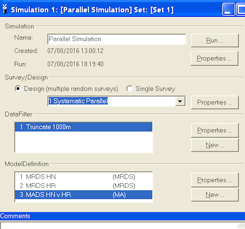
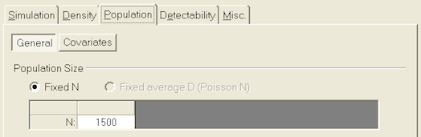
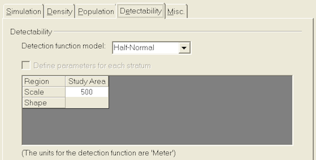

--- 
title: "Intermediate distance sampling workshop - St Andrews 2017"
author: "Laura Marshall, David L. Miller and Len Thomas"
date: '`r Sys.Date()`'
output:
  bookdown::pdf_book: 
    includes:
      in_header: preamble.tex
    keep_tex: TRUE
  bookdown::gitbook: default
csl: chicago-au-yr.csl
geometry: a4paper
documentclass: book
link-citations: yes
linkcolor: blue
css: details.css
site: bookdown::bookdown_site
bibliography: references.bib
---

```{r pdfmaker, echo=FALSE}
pdf <- TRUE
```

# Preface {-}

A bookdown version of the workshop practicals.  Section numbers correspond to practicals and topics:

| Section number | Topic | Scheduled |
|--------------:|:-----|:---------|
| 1  | R tutorial | Sunday pm |
| 2  | simple ds() of simulated data | Monday am |
| 3  | awkward data | Monday pm |
| 4  | DSsim | Monday pm |
| 5  | Sperm whale intro | Tuesday am |
| 6  | density surface | Tuesday am |
| 7  | density surface II | Tuesday pm |
| 8  | prediction with dsm | Wednesday am |
| 9  | variance with dsm | Wednesday pm |
| 10  | double observer | Thursday am |

<!--chapter:end:index.Rmd-->

# A hands on introduction to R tutorial

> prepared by Tiago A. Marques, Danielle Harris & Len Thomas

***

## Introduction

This tutorial was created as a gentle introduction to the R environment. It does not assume any basic knowledge about R, but some basic programming notions would be desirable.

There is an extensive community revolving around R, and abundant courses, tutorials, books, blogs, list servers, etc, freely available online. We provide here a small list of some of these:

* [R webpage](http://www.r-project.org) - the main R webpage, including links to downloading R, manuals, tutorials, dedicated search engines, etc.
* [R video tutorials](http://blog.revolutionanalytics.com/2013/08/google-video-r-tutorials.html) - video how to's in R
* [Online tutorial](http://www.datamind.org/) - a course with interactive exercises
* [Online course](https://www.datacamp.com/getting-started?step=2&track=r) - DataCamp commercial site
* [Reference card](http://cran.r-project.org/doc/contrib/refcard.pdf) - A very handy list of useful R functions
* [Short reference card](http://cran.r-project.org/doc/contrib/Short-refcard.pdf) - A longer reference card with most commonly used R functions

To facilitate the interaction with R we leverage on RStudio, a piece of software which allows users to have at a click's distance many useful features in R. In the following sections of the tutorial you will be guided through a first session of R via RStudio. 

The tutorial is intended to follow a brief presentation about R and RStudio, their interaction and capabilities. It assumes that R and RStudio have been previously installed in the computer you are using. The latest version of both software packages is recommended. Both are free and open source.

## Introduction to RStudio

Most users (except perhaps die-hard command line users) will use some sort of graphical user interface (GUI) to R. While the basic R installation comes with a simple GUI, here we adopt the use of RStudio, which considerably facilitates an introduction to R by providing many shortcuts and convenient features which we introduce next.

A major advantage of RStudio is that it makes it easy for you to type your R code into a script window, which you can easily save, and then send individual lines or blocks of code to the R command line to be acted upon.  This way, you have a record of what you have done, in the saved script file, and can easily reproduce it any time you like. We strongly recommend that you save your code script.

Given RStudio has been installed, when you double-click on a R workspace it should open in RStudio[^1]. After the presentation on R and RStudio you just sat through, from within RStudio you should be able to know where to find:


* the command line (bottom left pane[^2])
* the code scripts (top left pane)
* the workspace objects (top right pane)
* the loaded packages and how to load them (bottom right pane)
* the created plots (bottom right pane)
* the help files (bottom right pane)
* a file navigator system akin to windows explorer (bottom right pane)


Note that you can customize the aspect of RStudio (e.g. font size and colours of the smart syntax highlighting scheme) via `Tools|Global options`.

A very handy feature of RStudio is that you can preview the possible arguments of functions, as well as their description, directly when you are inserting the code. Let's try doing that. Type say `seq()` in the command line or the script window and then place the cursor between the parenthesis and press the `Tab` key... Is this a nice feature or what?

Now we have *met* RStudio and we know how it can make our life simpler, let's move on.

## A first session in RStudio

```{r openworkspace, echo=FALSE}
load("tutorial.Rdata")
```

We have provided a R workspace named `tutorial.Rdata`. Open RStudio and then open it by selecting `File|Open File`. We recommend that you begin by creating a script file (`Ctrl+Shift+N`, RStudio Shortcut) and use that to save and comment all your code that will be executed during the tutorial. In this way you will have a record of everything you did.

You know that R is ready to receive a command when you see the R prompt on the command line (on the bottom left tab by default in RStudio): ">". If you type a line of code that is not complete, R presents the "+" character, so that the user knows it expects the conclusion of the current line. Important note: while the prompt ">" and "+" will be shown in this tutorial's code, you should not try to add either ">" nor "+" to the command line: this is  something that R does for you and will complain if you try to do it yourself! [^3]

On the top right corner tab, where objects available in the `Environment` are listed, you can see that in `tutorial.Rdata` there are only two example objects. These are `x1` and `obj2`. We can print an object to the screen by simply typing its name and press enter (despite the fact that currently you can actually see the values on these objects `Environment` tab - but that is because they are simple objects and the workspace is almost empty. )

R is a very powerful calculator! Try some simple maths, say for example (you need to press enter after each line so that the line is evaluated)

```{r calc}
4+3
log(8)
sin(pi)
```

Tip: There is actually a simpler way to do sourcing from the script file in RStudio. CTRL-Enter is a keyboard shortcut for "source the current line of code in my script file and move the cursor to the next line". In general if you like keyboard shortcuts, look in RStudio under the menu ``Help | Keyboard shortcuts".

At the moment your workspace is almost empty, but we can change that easily by creating new objects. We will create a variable called `myvar1` which we will assign the value of 4. This is typically done using the assign operator `<-`.

```{r assign}
myvar1 <- 4
```

There are typically multiple ways to do the same thing in R, and this is sometimes referred to as a disadvantage. For simplicity, we deliberately avoid presenting the several alternatives for each action, and concentrate on the ones we prefer. This is not the same as saying these are the best, and if you continue to work with R you will likely get used to doing things your way - for now we do it our way!
  
An object should have been created in your workspace. You can list all objects in a given workspace using

```{r list}
ls()
```

You can also remove any object by using the `rm` function, so here we remove `myvar1`, `x1` and `obj2`

```{r rm}
rm(myvar1,x1,obj2)
```

and hence our workspace is empty again. Note the difference between `ls()` and `rm()`. While the first function does not need any arguments, the second requires at least one argument (but can take several). This can be easily seen by checking their help files and noting that `rm()` needs at least 1 explicit argument while `ls()` can work with defaults.

```{r helprm, eval=FALSE}
?rm
```

This is a convenient way to obtain more information about a given function. If one does not know what the name of the function might be, one can search for functions containing a given string. The following command lists all the functions with the string "mean" in them.

```{r appropos}
apropos("mean")
```

Not surprisingly, most if not all of these functions will be used for some kind of mean calculation. You can look into any one of them using the `?` as above. We have assigned a number to a variable , but we can actually more generally have vectors (strictly, `myvar1` was a numeric vector of length 1) containing variables. The following code assigns some numbers to 3 different vectors.

```{r seq}
x2 <- c(1,2,0.12,4,-22)
x3 <- seq(1,8,by=2)
#and a useful shortcut for sequences with the by argument = 1
x1 <- 1:5
```

The function `seq` is very useful for setting sequences of numbers. The optional arguments `length.out` and `along.with` provides extra flexibility. 

```{r showx1}
x1
```

We can use the usual mathematical operators over vectors. A few examples follow:

```{r mathops}
x1 + x2
x4 <- x1 + x2
x5 <- x1 - x2
x6 <- x1 * x2
x7 <- x1 / x2
x4
x5
x6
x7
```

Note that if the vectors are of the same length, R performs the operation element-wise. Another useful feature is that R recycles vectors if they are not the same length

```{r vecs}
x8 <- c(1,2,3,4)
x8 + 2
```

However, if one of the vectors is smaller, unexpected behaviour can happen, because R recycles elements regardless (so be careful, a warning is typically produced)

```{r recycle}
x9 <- c(3,4,5)
x10 <- c(0.7,0.9,1.3)
x9 + x10
x8 + x9
```


Notice that a warning message was produced when `x8` and `x9` were added. Usually these messages are important and should be read! Quite often the answer to your current question lies in the previous error or warning message.

Another useful function is `rep`, which allows one to create repetitions of patterns. As examples, see the difference between the next two lines of code

```{r rep3}
rep(c(1,2,3,4), times=3)
rep(c(1,2,3,4), each=3)
```

It is now time to end our first R session. At this point you need to decide what to do, as all objects created so far are in the memory, but this will be wiped out unless we explicitly save it to a file. The easiest way to do so is by calling the `save.image()` function.

```{r saveimg}
save.image(file="my1stR.Rdata")
```

Note the unusual extension name `.Rdata` associated with R workspaces (an R file is called a workspace). We could now load up this workspace in a new R session, or typically we will load up that workspace by starting R by double clicking on the file created. Do this to see that you retrieve the above created objects. Note that if you already have an R session open, you can load up any previously saved workspace via function `load()`.

Note that you have saved your workspace in some directory but you have not defined it. By default, this is your working directory. You can check what that directory currently is by using the following command

```{r getwd, eval=FALSE}
getwd()
```

You can always change the directory you are working on by setting it up explicitly to your desired location, using 

```{r lenwd, eval=FALSE}
#set the working directory - but remember to use your own path!!!
setwd("C:/Users/myusername/Desktop/mycourse")
#note how you can write comments in R by using "#"
#anything in front of # is not interpreted by R
#and treated as a comment
#you should have the good habit of extensively commenting
#all your code so that you know what you've done
#when you return to it even months or years later
```

We have just started R, created and removed some objects, and used simple functions like `ls()`, `seq()` or `save()`. R is an object oriented language, and functions and vectors are just examples of types of objects available in R. In Section \@ref(Types-classes) we go through the most common objects in R.

## Types and classes of objects {#Types-classes}

Objects can have classes, which allow functions to interact with them. Objects can be of several classes. We already used the class `numeric`, which is used for general numbers, but there are also additional very commonly used classes

* `integer`, for integer numbers
* `character`, just for character strings
* `factor`, used to represent levels of a categorical variable
* `logical`, the values TRUE and FALSE


While many others exist, these are the more commonly used. Outputs of some analyses have special classes, as an example, the output of a call of function `lm()` is an object of class `lm`, i.e., a linear model. Typically, functions behave differently according to the class of an object. As an example, note how `summary()` treats differently an object of class `factor` or one of class `numeric`, producing a table of counts per level for a factor but a 6 number summary for numeric values.

```{r factors}
obj1 <- factor(c(rep("a",12), rep("b",4), rep("c",2)))
summary(obj1)
obj2 <- c(2,5,-0.2,89,12,-3,-5.4)
summary(obj2)
```

We can check the class of an object using function `class`, as in the following examples

```{r classes}
class(obj1)
class(obj2)
class(TRUE)
```

It is sometimes useful to coerce objects into different classes, but care should be used when doing so. Some examples are presented below. Can you describe in your own words what R did below?

```{r as}
as.integer(c(3,-0.3,0.4,0.6,0.9,13.2,12))
as.numeric(c(TRUE,FALSE,TRUE))
as.numeric(obj1)
```

A common way to organize multiple vectors together is in the form of a matrix. Here we create such an object

```{r matrix}
mat1 <- matrix(1:12, nrow=3, ncol=4)
mat1
```

Note that by default R fills the first column (with 1,2,3) then the second column (4,5,6) etc.  If you want it to fill the first row, then the second, you can use the optional argument `byrow=TRUE`, like this:

```{r moremat}
matrix(1:12, nrow=3, ncol=4, byrow=TRUE)
```

R also allows data structures with more than 2 dimensions -- we don't cover those here, but look up the help on `array` if you're interested. A matrix is just a two dimensional array. 

Arrays are useful objects, but can be complex to visualize due to their potential high dimensionality. Another common type of object is a `data.frame`. This is essentially a matrix but for which each column can be of a different type. These are what we would typically associate with an excel spreadsheet or a table in a database. Typically columns correspond to variables observed in a number of subjects, each subject recorded in its own row. A simple example with 3 variables and 5 subjects follows:

```{r array}
mysex <- c("male","female","female","male","male")
myage <- c(34,23,56,45,12)
myhei <- c(185,178,167,165,148)
df1 <- data.frame(ID=1:5, sex=mysex, age=myage, height=myhei)
df1
```

Typically, `data.frames` are used to store the data we subsequently analyse. Usually the data are not manually imputed as above, but read into R from other software, using R functions addressed in a later section.

A data frame is just a special type of `list`. A `list` can contain objects of different types and dimensions. An example is here

```{r list1}
list1 <- list(Note="whatever I want here", X2=4, age=1:4)
list1
```

Lists are typically used to store outputs of computations which require different kinds of objects to be recorded. Note the use of `$` to access the sub-components of a list or a data.frame.

```{r list2}
list1$X2+10
```

A final type of object which we already used are functions. While there are thousands of available functions inside R, later we will learn how to create our own functions.

## Subsetting data

One useful feature of R relates to how we can index subsets of data. The indexing information is included within square brackets:`[]`. As an example, we can select the third element of a vector

```{r sub1}
x<-c(1,3.5,7,8,-7,0.43,-1)
x[3]
```

but we can also select all *except* the second and third elements of the same vector

```{r sub2}
x[-c(2,3)]
```

We can also select only the objects which follow a given condition, say only those that are positive

```{r sub3}
x[x>0]
```

or those between (-1,1)

```{r sub4}
x[(x>-1) & (x<1)]
```

Note the subtle difference between the previous and next statements

```{r sub5}
x[(x>=-1) & (x<=1)]
```

which reminds us we should be careful when setting these logical conditions, especially when working with integer boundaries which might be on the limits of those conditions. Note indexing can be done using additional information. As an example, we select here the elements in `x` such that the corresponding elements in `y` are positive:

```{r rnorm}
#rnorm(k) produces k Gaussian random deviates
x <- rnorm(10)
y <- rnorm(10)
x2 <- x[y>0]
```

When working on a matrix the indexing is done by row and column, therefore for selecting the value that is in the third row and second column of a matrix we use

```{r matloc1}
mat1[3,2]
```

but we can also select all the elements in the second row

```{r matloc2}
mat1[2,]
```

or the fourth column

```{r matloc3}
mat1[,4]
```


## Mathematical functions and simple data calculations

Within R there are a number of mathematical operators but also mathematical and statistical functions. As any other functions, many of these have required parameters and optional parameters. It would take a very long time to describe even the most basic functions. Therefore, we prefer to let you try hands on explore a number of these.

**Task 1**: Take your time to explore the functions below: 

|  |  |  |  |  |  |
| ----- | ----- | ----- | ----- | ----- | ----- |
| `sum(x)` | `sqrt(x)` | `log(x)` | `log(x,n)` | `exp(x)` | `choose(n,x)` |
| `factorial(x)` | `floor(x)` | `ceiling(x)` | `round(x,digits)` | `abs(x)` | `cos(x)` |
| `sin(x)` | `tan(x)` | `acos(x)` | `acosh(x)` | `max(x)` | `min(x)` |
| `mean(x)` | `median(x)` | `range(x)` | `var(x)` | `cor(x,y)` | `quantile(x)` |


(Tip: do not forget that you can get a full description what each function can be used for, what arguments it takes, and what kind of output it produces, using "?". Further, the help of most functions includes examples of their use, which proves invaluable to understand their usage.)

## Importing and exporting data

Rather than importing data into R manually, typically the data we work with are imported from some external source. Typically this might be some simple file format, like a txt or a csv file, but while not covered here, direct import from say Excel files or Access data bases is possible. Such more specialized inputs often require additional packages.

RStudio includes a useful dedicated shortcut "Import dataset", by default available through the top right window of RStudio's interface. Note this shortcut essentially just calls the appropriate functions required for each import. Here we present a couple of examples just for practising.

First, we load up a data frame which exists in R [^4] and contains an example data set, with variables measured in 150 flowers of 3 varieties. This is in object `iris`, and we use the function `data()` to load it so that we have access to it.

```{r iris}
data(iris)
```

we can take a look at what this data set contains

```{r lookiris}
# example of head use: see the first 4 rows in iris
head(iris, n=4)
# example of str use
str(iris)
# example of summary use
summary(iris)
```

Now we create a new data frame which we then modify to include a new variable

```{r changeiris}
mydata <- iris
mydata$total <- mydata$Sepal.Length + mydata$Sepal.Width + mydata$Petal.Length + mydata$Petal.Width
```

Now, we are going to export this data set as a txt, named `mydatafile.txt`

```{r write}
write.table(mydata, file="mydatafile.txt", row.names=FALSE)
```

Note the use of the optional argument `row.names=FALSE`, otherwise some arbitrary row names would be added to the file. If you look in the folder you are working in, you should now have a new file there. Open it and check that it looks as you would expect. Next, we are going to import it back into R, into an object named `indat`.

```{r read}
indat <- read.table(file="mydatafile.txt", header=TRUE)
```

So now we have our data back in R.

**Task 2**: Import the file `dados1.csv` into R, giving it the name `newfile`. Tips: Explore the possible options including 
1. `Import Dataset` shortcut in the `Environment tab`, 
2. the optional argument `sep=","` in function `read.table` or 
3. consider using function `read.csv()`.  

## Graphics

One of the most amazing R capabilities are its graphics customization properties. One can create pretty much any graphic output desirable. The plot function is, as we have seen before for function `summary()`, a function that attempts to do something smart depending on the type of arguments used. Using the data set iris previously considered, plot examples are implemented below, with some optional arguments being used to show some of the possibilities to customize plots.

```{r simpleplot}
#default use
plot(indat$Sepal.Length)
```

We now add some labels to a new plot of sepal length as a function of species (note the use of `~` to mean *as a function of*; this is also used below when specifying regression models, where the object on the left  of `~` will be the response variable and the objects on the right explanatory variables)

```{r flowerplot}
ys <- indat$Sepal.Length
xs <- indat$Species
#note use of ~ to represent "as a function of"
plot(ys~xs, ylab="Sepal Length (in mm)", main="Sepal length by species")
```

We can also set the graphic window to hold multiple plots. This is obtained via argument `mfrow`, one of the arguments in function `par` [^5]. An  example follows, in which we leverage on the use of function `with` to avoid having to constantly use `indat$` to tell R where the data can be found.

```{r plot2col}
#define two rows and 2 columns of plots
par(mfrow=c(3,2))
with(indat, hist(Sepal.Length, main=""))
with(indat, hist(Sepal.Width, main=""))
with(indat, hist(Petal.Length, main=""))
with(indat, hist(Petal.Width, main=""))
with(indat, plot(Petal.Length, Petal.Width, pch=21, col=12, bg=3))
with(indat, plot(Sepal.Length, Sepal.Width, pch=16, col=3))
```

We used argument `mfrow`, but looking at the help for function `par gives you an insight to the level of customization one can reach with respect to these graphical parameters, via dozens of different arguments.

We can look at the correlation structure between all variables using function `pairs()`.

```{r pairs}
# define two rows and 2 columns of plots
par(mfrow=c(1,1))
pairs(indat)
```

**Task 3**: Using data `cars`, create a plot that represents the stopping  distances as a function of the speed of cars. Use the `points` function to add a special symbol to points corresponding to cars with speed lower than 15 mph, but distance larger than 70m. Check out the function `text` to add text annotations to plots. Customize axis labels.

## Extending basic capabilities via packages

While R base installation includes enough functions that getting acquainted with them could take several years, many more are available via the installation of additional packages available online. A package is just a set of functions and data sets (and the corresponding documentation plus some additional required files) which usually have some specific goal. As examples, in our workshop we will be using packages `secr` and `mgcv`, which allow the implementation of spatially explicit capture recapture (SECR) models and generalized additive models (GAM), respectively.

Note packages cover a very wide range of applications, and chances are that at least a package, often more than one, already exists to implement most kinds of statistical or data processing tasks we might imagine.

Installing a new package in R requires a call to function `install.packages()`. A RStudio shortcut is simply to follow the `Tools|Install packages...` shortcut.

After a package is installed it needs to be loaded to be available. In R this is done calling function `library()` with the package name as an argument. In RStudio this becomes simpler by checking the boxes under the RStudio tab packages (by default this tab is available on the bottom right window, along with the Files, Plots, Help and Viewer tabs).

We use `secr` as an example. Notice, to begin with `secr` is not available

```{r secr}
?secr
```

Next, we install the package.

```{r secr1, eval=FALSE}
install.packages("secr")
```

Then, we load the package

```{r secr2}
library("secr")
```

and finally we check that the functions in it are now loaded

```{r secr3}
?secr
```

We would now be ready to analyse results from a SECR survey.

**Task 4**: Run the example code available in the help page from package `secr`. Try to understand what is happening: we simulate some SECR data and we then estimate density based on simulated capture histories. In particular, look at the simulated density and the estimated density. This is just a taster for the course to follow...!

## Linear regression

One of the most common type of data analysis is a regression model. Despite common and conceptually simple, it is a very powerful way to understand which (and how) of a number of candidate variables, sometimes referred to covariates, independent or explanatory variables, might influence a dependent variable, also often referred as the response. There are many flavours of regression models, from a simple linear regression to complicated generalized additive mixed models. We do not wish to present these in any detail, but to introduce you to some functions that implement these models and the syntax that R uses to describe them.

Let's start with the basics. You have used the `cars` data set above. We use it here again to try to explain the distance a car takes to stop as a function of its speed. We start with a linear model using function `lm()`

```{r lm}
data(cars)
mylm1 <- lm(dist~speed, data=cars)
```

We have stored the result of fitting the model in object `mylm1`. The function `summary()` can be used to print a summary of the fit

```{r lmsum}
summary(mylm1)
```

Do not get frightened about all the output. The coefficient associated with speed tells us what intuition alone would anticipate, the higher the speed, the larger the distance a car takes to stop. The easier way to see the relationship is by adding a line to the plot (note this is a similar plot to what you should have created in task 3 above!). The predicted relationship is shown in Figure \@ref(fig:plotreg).

```{r plotreg, fig.height=4, fig.cap="The data and the linear fit added to it."}
xl <- "Speed (mph)"
yl <- "Distance (m)"
plot(cars$speed, cars$dist, xlab=xl, ylab=yl, ylim=c(0,120) ,xlim=c(0,30))
abline(mylm1)
```

Note how function `abline()` is used with a linear model as its first argument and it uses the parameters in said object to add a line to the plot. The optional arguments `v` and `h` are often very useful to draw vertical and horizontal lines in plots.

**Task 5**: Use abline to draw dashed lines (tip, use optional argument `lty=2`) representing the estimated distance that a car moving at 16 mph would take to stop.

Note that the line added to the plot represents the distance a car would take to stop given its speed. Oddly enough, it seems like a car going at 3 mph might take a negative time to stop, which is just plain nonsense. Why? Because we used a model which does not respect the features of the data. A stopping distance can not be negative. However, implicit in the linear model we used, distance is a Gaussian (=normal) random variable. We can avoid this by using a generalized linear model (GLM). Now the response can have a range of distributions. An example of such distribution that takes only positive values is the gamma distribution. We implement a gamma GLM next

```{r fitglm}
#fit the glm
myglm1 <- glm(dist~speed, data=cars, family=Gamma(link=log))
#predict using the glm for speeds between 1 and 30
predmyglm1 <- predict.glm(myglm1, newdata=data.frame(speed=1:30), 
                          type="response")
```

Our model now assumes the response has a gamma distribution, and the link function is the logarithm. The link function allows you to change how the mean value is related to the covariates. This becomes rather technical rather fast. Details about glms are naturally beyond the scope of this tutorial. References like @Faraway2006 or @Zuur2009b will provide further details in an applied context. The predicted relationship is shown in Figure \@ref(fig:plotgam).

```{r plotgam, fig.height=4, fig.cap="The data and the linear and Gamma glm fits added to it."}
#create a plot
plot(cars$speed,cars$dist, xlab="Speed (mph)", ylab="Distance (m)", 
     ylim=c(0,120), xlim=c(0,30))
#add the linear fit
abline(mylm1)
#and now add the glm predictions
lines(1:30, predmyglm1, col="blue", lwd=3, lty=3)
```

However, this glm still requires that the response is linear at some scale (in this case, on the scale of the link function). Sometimes, non-linear effects are present. These can be fitted using generalized additive models. A good introduction to GAMs is provided by @Wood2006 and @Zuur2009b.

So finally we fit a gam model to the same data set. For that we require library `mgcv`. The outcome is shown in Figure \@ref(fig:gamfitplot). Here the fit is not very different from the glm fit, but under many circumstances a gam might be required over a glm. We will see such an example in the next few days, when we model the detectability of beaked whale clicks as a function of distance and angle (with respect to hydrophones).

```{r gamfit}
#load the mgcv library
library(mgcv)
#fit the gam
mygam1 <- gam(dist~s(speed), data=cars, family=Gamma(link=log))
#predict using the glm for speeds between 1 and 30
predmygam1 <- predict(mygam1, newdata=data.frame(speed=1:30), type="response")
```

```{r gamfitplot, fig.height=4, fig.cap="The data and the linear and Gamma glm and gam fits added to it."}
#create a plot
plot(cars$speed, cars$dist, xlab="Speed (mph)", ylab="Distance (m)", 
     ylim=c(0,120), xlim=c(0,30))
#add the linear fit
abline(mylm1)
#and now add the glm predictions
lines(1:30, predmyglm1, col="blue", lwd=3, lty=3)
lines(1:30, predmygam1, col="green", lwd=3, lty=2)
```

## Some advanced capabilities of R

### Simulation and random number generation

Another powerful use of R is for simulation. To this end, R has the ability to simulate random deviates from a large number of distributions. Perhaps the more useful and commonly used are the uniform and the Gaussian distributions. We now create 50 random deviates from each of these, as well as some Poisson deviates, for illustration

```{r somerand}
#define two rows and 2 columns of plots
rdnorm <- rnorm(50,mean=20,sd=3)
rdunif <- runif(50,min=3,max=6)
rdpois <- rpois(50,lambda=6)
```

R can create random numbers from many different distributions (see help(Distributions) for a list) -- the relevant functions generally start with r and then an abbreviated distribution name (rbinom, rexp, rgeom, etc). Additionally, R also includes the ability to obtain the density function, distribution function and quantile function via the `d`+name, `p`+name and `q`+name functions. As an example, the Gaussian function usage of these functions is presented below

```{r morerand}
dnorm(0,mean=0,sd=1)
pnorm(0,mean=0,sd=1)
qnorm(0.975,mean=0,sd=1)
```

**Task 6**: Using what you have learnt here, create two histograms, one of 50, another of 5000, random deviates from a Gaussian distribution, using the optional argument `freq=FALSE` (leading to an estimate of the density function). Then add a line to the plot that represents the true underlying density (tip, you can use function `dnorm()`), and comment on the results.


### Writing your own functions

While the above functions, and the many more available, make R a very useful tool, there are sometimes problems which require a special tool. For these, we can create our own functions. Note this is an advanced topic.

The way of doing that follows a specific syntax

```
> name <- function(arg1,arg2,...) {what the function does goes here}
```

As an example, we create a function that returns the sum of its arguments:

```{r myown}
myfun <- function(i,j){
  myres <- i + j
  return(myres)
}
```

**Task 7**: create a function called `mystats()` which returns the mean, variance, maximum and minimum of the first argument (a vector). Then, update your function such that it can also return the mean excluding the negative numbers.


## Wrap up

A full introduction to R course could take an entire week. A full course in regression modelling with R could take an entire semester. A full course of data analysis in R could take a life time.

Our objective with this tutorial was simply to introduce you to R such that when we use R in the next few days, the commands do not look too esoteric. Nonetheless, this material as well as the references provided should constitute a good basis to learn R further if you so desire. Beginners find the learning curve is often steep, but once mastered, R simplifies enormously the task of statistical data analysis.

```{r tidyup}
#cleaning the workspace
rm(list = ls())
```

[^1]: If this fails, you might have to first associate .Rdata files with RStudio.
[^2]: All the tab positions are the RStudio defaults, but this can be customized by the user later.
[^3]: Past experience tells us that more than one person will have problems because they forgot to delete a ">" and/or "+"  from the code below when they copy paste the code into their own R sessions. Avoid being that person!
[^4]: R includes a large variety of example data sets which are useful to illustrate the use of code.
[^5]: Note this function controls a much larger number of graphical parameters. You can take a look at its help file to get a feel for how many and what kind of control it allows you.

<!--chapter:end:01-Rtutorial.Rmd-->

# analyse simulated data set

## Laura to prepare

<!--chapter:end:02-simple-analysis-simulated.Rmd-->

# Problem datasets 

## Len to prepare

### Blue monkey data set

* [Distance 7 project](Difficult data/D7BlueMonkey - Demo 3.zip)
* [Data as csv for R analysis](Difficult data\BlueMonkey.csv)

### Odd spike data set

* [Distance 7 project](Difficult data/D7OddSpike - Demo 2.zip)
* [R script to manufacture and conduct analysis](Difficult data\Oddspike.r)

<!--chapter:end:03-problem-datasets.Rmd-->

#  Creating distance sampling simulations using DSsim 

> Assumes home directory is directory in which exercise has been expanded

## Aim
The aim of this exercise is to run simulations which will allow you to compare three different survey designs for a specific population. You should judge these designs on their accuracy and precision.

You will also need the following R packages installed on your machine: DSsim, shapefiles, splancs and mrds. Now examine the other files and folders in the "DSsim Exercise" folder. There are three files starting with the name "Region" and ending with .dbf, .shp and .shx, these files make up the shapefile for the survey region. The "density.surface.robj" file is the density surface for the survey region. The "Survey Transects" folder contains a folder for each of the designs you are asked to look at, these contain the transect shapefiles. The "Results" folder contains the results from 999 replications as this can take a good few hours to run. To setup the workspace first load the libraries DSsim and shapefiles, loading these two will automatically make splancs and mrds available.

```{r setupDSsim, message=FALSE, warning=FALSE}
library(DSsim)
library(shapefiles)
```

## Create a region object

Read the Region shapefile into R using the read.shapefile function from the shapefiles library.

```{r regionobjDSsim}
region.shapefile <- read.shapefile("Region")
```

Next you are going to create the region object using this shapefile. As there are no strata you only need to provide a name for your survey region and the units which are in metres (m). The survey region is displayed in Figure \@ref(fig:finishreg).

```{r finishreg, fig.cap="Study region for simulation"}
region <- make.region(region.name = "Survey Region", units = "m", 
                      shapefile = region.shapefile)
plot(region, plot.units = "km")
```

## Create a density object
You are now going to create a density object within this region. For the purposes of this exercise a density surface has already been created and can be loaded as follows:

```{r densobjload}
load("density.surface.robj")
```

You will see that an object called "density.surface" has appeared in the workspace. This object is a list with one element (if the region had been divided up into strata then this list would contain an element for each strata). To have a look at what the density surface data look like type `head(density.surface[[1]])`. You can see that it is a data set of x and y locations and the densities at each point.

To create the density object you will need to provide the density surface, the region object for which it was created and the grid spacing that was used. I used a grid spacing of 1,000 m in both the x and y directions to create this density surface. The density surface describing animal distribution is shown in Figure 4.2.

```{r popden, fig.cap="Study region with animal density superimposed\nNote lower density near the trail system"}
pop.density <- make.density(region = region, density.surface = density.surface, 
                            x.space = 1000, y.space = 1000) 
plot(pop.density, plot.units = "km")
plot(region, add = TRUE)
```

Optionally, the following code can be used to define your own density surface. Firstly the density object is created with a constant value, then high and low spots can be added with varying radii of influence. The sigma parameter is used to calculate a Gaussian decay around the central point.

```{r altdensity, eval=FALSE}
alternative.density <- make.density(region = region, x.space = 1000, 
                                    y.space = 1000, constant = 0.4e-7)

alternative.density <- add.hotspot(alternative.density, centre = c(-2500, 2224000), 
                                   sigma = 10000, amplitude = 0.1e-7)
alternative.density <- add.hotspot(alternative.density, centre = c(0, 2184000), 
                                   sigma = 18000, amplitude = -0.5e-8)
```


## Creating population description and detectability objects
For this exercise we will fix the population size at 1500 individuals. To do this set N = 1500 and tell it to generate exactly this number of individuals (fixed.N = TRUE).

```{r popdescr}
pop.description <- make.population.description(region.obj = region, 
                                               density.obj = pop.density, 
                                               N = 1500, fixed.N = TRUE)
```

We will now describe the detectability of the population using a half-normal function with a sigma (scale.param) of 500 m and a truncation distance of 1000 m. This means that around 2/3 of the detections will be made within 500 m of the transect and we will exclude anything sighted further than 1000 m perpendicular distance from the transect.
```{r detect}
detect <- make.detectability(key.function = "hn", scale.param = 500, truncation = 1000)
```
## Creating the survey design object

We will now create a design object. For now concentrate on the subjective design, we will come back to the parallel and zigzag designs later. The subjective design was based on using some **existing paths** to make the survey easier to carry out. Additional transects were then added to achieve a more even coverage of the survey region.

NOTE: The path argument to describe where the files are located must match your previous settings add "/Survey Transects/Subjective Design".
```{r subjdes}
subjective.design <- make.design(transect.type = "Line", 
                                 design.details = c("user specified"), 
                                 region = region, 
                                 plus.sampling = FALSE, 
                                 path = "Survey Transects/Subjective Design")
```

## Creating the analyses object

The final thing we need to do before creating the simulation object is describe the analyses we wish to carry out on the simulated data. Let's try letting it choose between a half-normal and a hazard rate model based on the AIC values.
```{r detmodchoices}
ddf.analyses <- make.ddf.analysis.list(
                dsmodel = list(~cds(key = "hn", formula = ~1), #half-normal model
                               ~cds(key = "hr", formula = ~1)),  #hazard rate model
                method = "ds", criteria = "AIC", truncation = 1000)
```

## Creating the simulation object

We can finally put it all together and have a look at some example populations, transects and survey data. I suggest you set the number of repetitions (reps) to be fairly low or else it will take a long time to run. For the subjective design you need to specify that it will be using the same set of transects each time, single.transect.set = TRUE.
```{r simulation-characters}
my.simulation.subjective <- make.simulation(reps = 10, 
                                            single.transect.set = TRUE, 
                                            region.obj = region, 
                                            design.obj = subjective.design, 
                                            population.description.obj = pop.description,
                                            detectability.obj = detect, 
                                            ddf.analyses.list = ddf.analyses)
```

Before running the simulation it is a good idea to have a check to see that it is doing what you want. The function `check.sim.setup()` will allow you to investigate the simulation properties. Having created a population, transects, survey and detections, the function plots them to assure you are happy with the simulation structure.

Let's check our subjective design simulation, see Figure \@ref(fig:plotsimul).

```{r plotsimul, cache=TRUE, fig.cap="Region, population, transects, detections"}
check.sim.setup(my.simulation.subjective)
```

Once you are happy it is time to run the simulation. Please be patient as it will take a few minutes to complete.

```{r conductsim, comment=NA, cache = TRUE, results='hide'}
my.simulation.subjective  <- run(my.simulation.subjective)
summary(my.simulation.subjective, description.summary = FALSE)
```

## Now for the automated designs: Parallel lines

You will need to create a new simulation each with a new design object for the parallel design. The other objects (region, density, population description etc.) should be left the same. 

NOTE: We now wish different transects to be used on each repetition (`single.transect.set = FALSE`). 
```{r design-parallel}
parallel.design <- make.design(transect.type = "Line",
                               design.details = c("Parallel","Systematic"),
                               region.obj = region, design.axis = 45,
                               spacing = 12000, plus.sampling = FALSE,
                               path = "Survey Transects/Parallel Design")

my.simulation.parallel <- make.simulation(reps = 10, 
                                          single.transect.set = FALSE, 
                                          region.obj = region, 
                                          design.obj = parallel.design, 
                                          population.description.obj = pop.description,
                                          detectability.obj = detect,
                                          ddf.analyses.list = ddf.analyses)
```
Having created the features of the simulation, we want to check features of the simulation have been correctly specified, see Figure \@ref(fig:parallelcheck).

```{r parallelcheck, cache = TRUE, fig.cap="Check setup of parallel transect design simulation"}
check.sim.setup(my.simulation.parallel)
```

When satisfied with this simulation setup, you would proceed to run your parallel design simulation. 
```{r parallel-run, cache = TRUE, comment=NA, results='hide'}
my.simulation.parallel  <- run(my.simulation.parallel)
summary(my.simulation.parallel, description.summary = FALSE)
```


### ZigZag survey design
Now have a go at creating and running a simulation using the equal spaced zigzag design transects in the "Zigzag Design" folder. The spacing used to generate these was 8250m on a design axis of 135 degrees. Use `?make.design` for help.

```{r design-zigzag, echo=FALSE, eval=TRUE}
zigzag.design <- make.design(transect.type = "Line",
                               design.details = c("Zigzag","Equal Spaced"),
                               region.obj = region, design.axis = 135,
                               spacing = 8250, plus.sampling = FALSE,
                               path = "Survey Transects/Zigzag Design")

my.simulation.zigzag <- make.simulation(reps = 10, 
                                          single.transect.set = FALSE, 
                                          region.obj = region, 
                                          design.obj = zigzag.design, 
                                          population.description.obj = pop.description,
                                          detectability.obj = detect,
                                          ddf.analyses.list = ddf.analyses)
```
Having created the features of the simulation, check the features of the simulation have been correctly specified (Fig. \@ref(fig:zigzagcheck)).

```{r zigzagcheck, fig.cap="Check setup of zigzag transect design simulation", eval=TRUE, echo=FALSE}
check.sim.setup(my.simulation.zigzag)
```

When satisfied with this simulation setup, you would proceed to run your zigzag design simulation. 
```{r zigzag-run, comment=NA, eval=FALSE}
my.simulation.zigzag  <- run(my.simulation.zigzag)
summary(my.simulation.zigzag)
```


## Results from 999 repetitions

I ran each of these simulations 999 times and stored the simulations as r objects. Load these into the R workspace using the following code:

```{r bluepeter, eval=FALSE}
load("Results/simulation.subjective.robj")
load("Results/simulation.parallel.robj")
load("Results/simulation.zigzag.robj")
```

The objects `simulation.subjective`, `simulation.parallel` and `simulation.zigzag` will now be in your workspace. Have a look at the results using the `summary()` function and use them to fill in the table below, Figure 4.5.

```{r bluepeter-summaries, eval=FALSE}
summary(simulation.subjective)
summary(simulation.parallel)
summary(simulation.zigzag)
```

Which survey design would you recommend? Why?     
What would happen if our assumptions about animal distribution were incorrect?


## Running distance sampling simulations using Distance 7.1

If you would like to investigate different designs then these can be created and used in simulations in Distance 7.1. Note that currently the simulation options in Distance 7.1 are somewhat more restricted than in DSsim. 

We have created a Distance project based on the scenario just described and setup the systematic parallel and equal spaced zigzag designs as specified above. This project is named `DSsimExercis`e. This exercise will lead you through replicating the previous simulations in Distance, but you could choose to invesgitate different designs or even try out some simulations on your own study area if you prefer. 

If you wish to try out simulations on your own study area help on importing geographic data, creating designs and analyses can be found in the Distance manual. 

## Creating simulations in Distance

### Simulation Details

Open the `DSsimExercise.dst` project and navigate to the Simulation Browser tab (on the far right, with the rabbit coming out of the hat). Now create a new simulation and give it a meaningful name. Open the details for this simulation, Figure 4.6.

* Select the **design** option for these simulations as we want to use a different survey (set of transects) in each iteration and then select which design to use from the dropdown menu. 
    + Distance will generate the required number of surveys for the simulation. (Selecting the **survey** option will instruct Distance to use only a single set of transects for the whole simulation.)     
* Select a data filter with an absolute right truncation distance. 
    + The truncation distance specified in the data filter will give the greatest perpendicular distance at which an observation can be made and the distance to which the detection function model(s) will be fitted.     
* Select one or more (mrds) models to fit to the simulated data. Here we can use the MADS HN v HR model definition (ID 3) to point to both the half-normal and hazard rate model definitions. 
    + Use the Properties button to have a look at the MADS model definition properties, particularly the detection function tab. 
    + The model with the minimum AIC will be selected in each simulation iteration. 



### Simulation Properties

Now click on the Simulation 'Properties' button to set the other simulation properties. The Simulation tab (Figure 4.7) allows us to specify the geographic layer to use, in this example as we do not have strata we must select the global study region layer. Here we can also tell Distance how many times to repeat the simulation and set shapefile options. It is sensible to run the simulation only once in the first instance to check the setup is correct. The shapefile options allow us to tell Distance to save the shapefiles for use in subseqent simulations using the same design. This can save some processing time. If requested the shapefiles are stored in the project .dat folder under 'Simulation/Simulation[ID]/shapefiles'.    


Next we can define our density surface which describes animal distribution (Figure 4.8). As in exercise 1A we can select a grid spacing of 1000. Distance has more restricted options than DSsim. Currently we are only able to specify a constant density surface with hot/low spots. Note that this density surface is just giving Distance the relative (rather than absolute) densities.    


\newpage

The Population tab (Figure 4.9) currently only requires that we provide a population size, in this case 1500.       



Next we describe the detectability of the animals. We will assume a half-normal detection function with sigma = 500m (Figure 4.10). The units of the detection function parameters must be the same as those of the study region and a reminder is provided below the table.            



Finally we can select some miscelaneous options. These do not affect the output seen within distance. The option to run the simulation in parallel can speed things up if running more than a few iterations. Saving the results from each iteration to file will create csv files with the individual estimates from each repetition. Saving an example dataset will create a csv file that is ready to be read into a distance project for analysis. These files are stored in the project .dat folder under 'Simulation/Simulation[ID]'.      

Further instructions on setting up different simulations options can be found in the Distance manual.

### Results

Solutions to this practical can be found in the DSsimExerciseSolutions.dst project. In this project both the parallel and zigzag design simulations have been run 100 times.       

Note that even though the designs were never initially run to estimate coverage, when a simulation is run this triggers the design to be run. Therefore, the design results give the coverage for the actual sets of transects used in the simulation.


<!--chapter:end:04-DSsim.Rmd-->

# Preparing survey data for spatial analysis

## Aims

By the end of this practical, you should feel comfortable:

- Loading data from a geodatabase file into R
- Removing and renaming columns in a `data.frame`
- Saving data to an `RData` file

Note we can (and should) re-run this file when we update the `Analysis.gdb` file to ensure that the data R uses has all of the covariates we want to use in our analysis.

## Preamble

Load some useful packages:

```{r load-packages, message=FALSE}
library(rgdal)
library(knitr)
```

## Load and arrange data

To fit our spatial models we require three objects:

  1. The detection function we fitted previously.
  2. The segment data (sometimes called effort data). This tells us how much effort was expended per segment (in this case how far the boat went) and includes the covariates that we want to use to fit our model.
  3. The observation table. This links the observations in the detection function object to the segments.

In R we can use the `rgdal` package to access the geodatabase files generated by ArcGIS (R can also access shapefiles and rasters).

It can be useful in general to see which "layers" are available in the geodatabase, for that we can use the `ogrListLayers()` function:
```{r list-layers}
ogrListLayers("Analysis.gdb")
```

### Segment data

For our analysis the segment data is located in in the "Segment_Centroids" table in the geodatabase. We can import that into R using the `readOGR()` function:
```{r segs-data-load}
segs <- readOGR("Analysis.gdb", layer="Segment_Centroids")
```

To verify we have the right data we can plot it. This will give the locations of each segment:
```{r segs-data-plot, fig.width=4, fig.height=4, fig.cap="Segment centroid locations for spearm whale dataset."}
plot(segs)
```

A further check would be to use `head()` to check that the structure of the data is correct. In particular it's worth checking that the column names are correct and that the number of rows in the data set are correct (`dim()` will give the number of rows and columns).

It can also be useful to check that the columns are the correct data types. Calling `str(segs@data)` (or any object loaded using `readOGR` appended with `@data`) will reveal the data types of each column. In this case we can see that the `CenterTime` column has been interpreted as a `factor` variable rather than as a date/time. We're not going to use it in our analysis, so we don't need to worry for now but `str()` can reveal potential problems with loaded data.

For a deeper look at the values in the data, `summary()` will give summary statistics for each of the covariates as well as the projection and range of location values (lat/long or in our case `x` and `y`). We can compare these with values in ArcGIS.

We can turn the object into a `data.frame` (so R can better understand it) and then check that it looks like it's in the right format using `head()`:
```{r segs-data-df}
segs <- as.data.frame(segs)
head(segs)
```
As with the distance data, we need to give the columns of the data particular names for them to work with `dsm`:
```{r rename-segs-cols}
segs$x <- segs$POINT_X
segs$y <- segs$POINT_Y
segs$Effort <- segs$Length
segs$Sample.Label <- segs$SegmentID
```

### Observation data

The observation data is exactly what we used to fit out detection function in the previous exercise (though this is not necessarily always true).

```{r obs-data-load}
obs <- readOGR("Analysis.gdb", layer="Sightings")
```

Again we can use a plot to see whether the data looks okay. This time we only have the locations of the observations:
```{r obs-data-plot, fig.height=4, fig.width=4, fig.cap="Sighting locations for spearm whale dataset."}
plot(obs)
```

Again, converting the object to be a `data.frame` and checking it's format using `head()`:
```{r obs-data-df}
obs <- as.data.frame(obs)
head(obs)
```

Finally, we need to rename some of the columns:
```{r rename-obs-cols}
obs$distance <- obs$Distance
obs$object <- obs$SightingID
obs$Sample.Label <- obs$SegmentID
obs$size <- obs$GroupSize
```


## Save the data

We can now save the `data.frame`s that we've created into an `RData` file so we can use them later.

```{r save-models}
save(segs, obs, file="sperm-data.RData")
```


<!--chapter:end:05-process-geodata.Rmd-->

---
output:
  html_document: default
  pdf_document: default
---
# Detection function fitting

## Aims

By the end of this practical you should feel confident doing the following:

- Loading data from ArcGIS `.gdb` files
- Working on a `data.frame` in R to get it into the correct format for `Distance`
- Fitting a detection function using `ds()`
- Checking detection functions
- Making at goodness of fit plots
- Selecting models using AIC
- Estimating abundance (using R and maths!)


## Preamble

First need to load the requisite R libraries
```{r pdfmakerddf, echo=FALSE}
pdf <- TRUE
```


```{r load-libraries, messages=FALSE}
library(rgdal)
library(ggplot2)
library(Distance)
library(knitr)
library(kableExtra)
```

## Load the data

The observations are located in a "geodatabase" we created in Arc. We want to pull out the "Sightings" table (called a "layer") and make it into a `data.frame` (so it's easier for R to manipulate).

```{r load-data}
distdata <- readOGR("Analysis.gdb", layer="Sightings")
distdata <- as.data.frame(distdata)
```


We can check it has the correct format using `head`:
```{r disthead}
head(distdata)
```

The `Distance` package expects certain column names to be used. Renaming is much easier to do in R than ArcGIS, so we do it here.
```{r rename-cols}
distdata$distance <- distdata$Distance
distdata$object <- distdata$SightingID
distdata$size <- distdata$GroupSize
```
Let's see what we did:
```{r disthead2}
head(distdata)
```
We now have four "extra" columns.

## Exploratory analysis

Before setting off fitting detection functions, let's look at the relationship of various variables in the data.

*Don't worry too much about understanding the code that generates these plots at the moment.*

### Distances

Obviously, the most important covariate in a distance sampling analysis is distance itself. We can plot a histogram of the distances to check that (1) we imported the data correctly and (2) it conforms to the usual shape for line transect data.

```{r eda-dist, fig.height=4, fig.cap="Distribution of observed perpendicular detection distances."}
hist(distdata$distance, xlab="Distance (m)", main="Distance to sperm whale observations")
```


### Size and distance

We might expect that there will be a relationship between the distance at which we see animals and the size of the groups observed (larger groups are easier to see at larger distances), so let's plot that to help us visualise the relationship.


```{r eda-covars, fig.width=12, fig.cap="Effect of group size upon detection distances."}
# plot of size versus distance and sea state vs distance, linear model and LOESS smoother overlay

# put the data into a simple format, only selecting what we need
distplot <- distdata[,c("distance","size","SeaState")]
names(distplot) <- c("Distance", "Size", "Beaufort")
library(reshape2)
# "melt" the data to have only three columns (try head(distplot))
distplot <- melt(distplot, id.vars="Distance", value.name="covariate")

# make the plot
p <- ggplot(distplot, aes(x=covariate, y=Distance)) +
      geom_point() +
      facet_wrap(~variable, scale="free") +
      geom_smooth(method="loess", se=FALSE) +
      geom_smooth(method="lm", se=FALSE) +
      labs(x="Covariate value", y="Distance (m)")
print(p)
```

### Distance and sea state

We might also expect that increasing sea state would result in a drop in observations. We can plot histograms of distance for each sea state level (making the sea state take only values 0,1,2,4,5 for this).

```{r eda-dist-facet-seastate, fig.cap="Effect of sea state upon detection distances."}
distdata$SeaStateCut <- cut(distdata$SeaState,seq(0,5,by=1), include.lowest=TRUE)
p <- ggplot(distdata) +
      geom_histogram(aes(distance)) +
      facet_wrap(~SeaStateCut) +
      labs(x="Distance (m)", y="Count")
print(p)
```

### Survey effect

Given we are including data from two different surveys we can also investigate the relationship between survey and distances observed.

```{r eda-dist-facet-survey, fig.cap="Effect of survey upon detection distances."}
p <- ggplot(distdata) +
      geom_histogram(aes(distance)) +
      facet_wrap(~Survey) +
      labs(x="Distance (m)", y="Count")
print(p)
```

## Fitting detection functions

It's now time to fit some detection function models. We'll use the `ds()` function from the `Distance` package to fit the detection function. You can access the help file for the `ds()` function by typing `?ds` -- this will give you information about what the different arguments to the function are and what they do.

We can fit a very simple model with the following code:
```{r simple-df}
df_hn <- ds(data=distdata, truncation=6000, key="hn", adjustment=NULL)
```

Let's dissect the call and see what each argument means: 

- `data=distdata`: the data to use to fit the model, as we prepared above.
- `truncation=6000`: set the truncation distance. Here, observations at distances greater than 6000m will be discarded before fitting the detection function.
- `key="hn"`: the key function to use for the detection function, in this case half-normal (`?ds` lists the other options).
- `adjustment=NULL`: adjustment term series to fit. `NULL` here means that no adjustments should be fitted (again `?ds` lists all options).

Other useful arguments for this practical are:

- `formula=`: gives the formula to use for the scale parameter. By default it takes the value `~1`, meaning the scale parameter is constant and not a function of covariates.
- `order=`: specifies the "order" of the adjustments to be used. This is a number (or vector of numbers) specifying the order of the terms. For example `order=2` fits order 2 adjustments, `order=c(2,3)` will fit a model with order 2 and 3 adjustments (mathematically, it only makes sense to include order 3 with order 2). By default the value is `NULL` which has `ds()` select the number of adjustments by AIC.

```{asis, d7detfn, echo=!pdf}
***
<details>
<summary>Distance 7 instructions</summary>
Steps to fit detection function using graphical interface
<ol> 
<li> Distance 7 project has been created for you and can be opened from a .zip archive
<ul><li>Spend time examining the structure of data in the Data tab.</ul>

<li> Move to the Analysis tab.
<li> Create a new analysis.
<li> Create a data filter to set the truncation distance to 6000m.

<li> Create a model specifying MRDS analysis engine with half-normal detection function.

<li> Press `Run` and examine contents of output window.  The results should be identical to those produced in the Summaries section below.
</ol>
</details>

***
```

### Summaries

We can look at the summary of the fitted detection function using the `summary()` function:
```{r simple-summary}
summary(df_hn)
```

### Goodness of fit

Goodness of fit quantile-quantile plot and test results can be accessed using the `ddf.gof()` function:
```{r simple-gof, fig.width=4, fig.height=4, fig.asp=1, fig.cap="Goodness of fit QQ plot of half-normal detection function."}
ddf.gof(df_hn$ddf)
```

Note two things here:
1. We use the `$ddf` element of the detection function object
2. We're ignoring the $\chi^2$ test results, as they rely on binning the distances to calculate test statistics where as Cramer-von Mises and Kolmogorov-Smirnov tests do not.


### Plotting

We can plot the models simply using the `plot()` function:
```{r simple-plot, fig.height=4, fig.cap="Half-normal detection function."}
plot(df_hn)
```

The dots on the plot indicate the distances where observations are. We can remove them (particularly useful for a model without covariates) using the additional argument `showpoints=FALSE` (try this out!).

## Now you try...

Now try fitting a few models and comparing them using AIC. Don't try to fit all possible models, just try a selection (say, a hazard-rate, a model with adjustments and a couple with different covariates). You can also try out changing the truncation distance.

Here's an example to work from. Some tips before you start:

* You can include as many lines as you like in a given chunk (though you may find it more manageable to separate them up, remembering each time to give the chunk a unique name).
* You can run the current line of code in RStudio by hitting `Control+Enter` (on Windows/Linux; `Command+Enter` on Mac).
* Giving your models informative names will help later on! Here I'm using `df_` to indicate that this is a detection function, then shortened forms of the model form and covariates, separated by underscores, but use what makes sense to you (and future you!).

```{r trying-models}
df_hr_ss_size <- ds(distdata, truncation=6000, adjustment=NULL, 
                    key="hr", formula=~SeaState+size)
```

Once you have the hang of writing models and looking at the differences between them, you should move onto the next section.

## Model selection

Looking at the models individually can be a bit unwieldy -- it's nicer to put that data into a table and sort the table by the relevant statistic.  The function `summarize_ds_models()` in the `Distance` package performs this task for us.

The code below will make a results table with relevant statistics for model selection in it. The `summarize_ds_models()` function takes a series of object names as its first argument. We can do that with the two models that I fitted like so:

```{r df-results}
model_table <- summarize_ds_models(df_hn, df_hr_ss_size)
kable(model_table, digits=3, format="latex", booktabs=TRUE, row.names = FALSE, escape=FALSE,
      caption = "Comparison of half normal and hazard rate with sea state and group size.") %>%
  kable_styling(latex_options="scale_down")
```

(You can add the models you fitted above into this list.)

#### A further note about model selection for the sperm whale data

Note that there is a considerable spike in our distance data. This may be down to observers guarding the trackline (spending too much time searching near zero distance). It's therefore possible that the hazard-rate model is overfitting to this peak. So we'd like to investigate results from the half-normal model too and see what the effects are on the final spatial models.


### Estimating abundance

Just for fun, let's estimate abundance from these models using a Horvtiz-Thompson-type estimator.

We know the Horvitz-Thompson estimator has the following form:
$$
\hat{N} = \frac{A}{a} \sum_{i=1}^n \frac{s_i}{p_i}
$$
we can calculate each part of this equation in R:

- `A` is the total area of the region we want to estimate abundance for. This was $A=5.285e+11 m^2$.
- `a` is the total area we surveyed. We know that the total transect length was 9,498,474m and the truncation distance. Knowing that $a=2wL$ we can calculate $a$.
- $s_i$ are the group sizes, they are stored in `df_hn$ddf$data$size`.
- $p_i$ are the probabilities of detection, we can obtain them using `predict(df_hn$ddf)$fitted`.

We know that in general operations are vectorised in R, so calculating `c(1, 2, 3)/c(4, 5, 6)` will give `c(1/4, 2/5, 3/6)` so we can just divide the results of getting the $s_i$ and $p_i$ values and then use the `sum()` function to sum them up.

Try out estimating abundance using the formula below using both `df_hn` and your favourite model from above:

```{r ht-estimate}

```

Note that in the solutions to this exercise (posted on the course website) I show how to use the function `dht()` to estimate abundance (and uncertainty) for a detection function analysis. This involves some more complex data manipulation steps, so we've left it out here in favour of getting to grips with the mathematics.

#### Accounting for perception bias

It's common, especially in marine surveys, for animals at zero distance to be missed by observers. There are several ways to deal with this issue. For now, we are just going to use a very simply constant correction factor to inflate the abundance.

From @Palka2006, we think that observations on the track line were such that $g(0)=0.46$, we can apply that correction to our abundance estimate (in a very primitive way):

```{r ht-perception}
```

This kind of correction works fine when we have a single number to adjust by, in general we'd like to model the perception bias using "mark-recapture distance sampling" techniques.

### Save model objects

Save your top few models in an `RData` file, so we can load them up later on. We'll also save the distance data we used to fit out models.

```{r save-models-01}
save(df_hn, df_hr_ss_size, # add you models here, followed by commas!
     distdata,
     file="df-models.RData")
```

You can check it worked by using the `load()` function to recover the models.

<!--
### References

Palka, D. (2006). Summer Abundance Estimates of Cetaceans in US North Atlantic Navy Operating Areas. Northeast Fisheries Science Center Reference Document 06-03. [Available online here](http://www.nefsc.noaa.gov/nefsc/publications/crd/crd1229/crd1229.pdf)
-->

<!--chapter:end:06-detection-functions.Rmd-->

# Simple density surface models

## Aims

By the end of this practical, you should feel comfortable:

- Fitting a density surface model using `dsm()`
- Understanding what the objects that go into a `dsm()` call
- Understanding the role of the response in the `formula=` argument
- Understanding the output of `summary()` when called on a `dsm` object
- Increasing the `k` parameter of smooth terms to increase their flexibility
- Interpreting `gam.check` and `rqgam.check` plots and diagnostic output

The example code below uses the `df_hn` detection function in the density surface models. You can substitute this for your own best model as you go, or copy and paste the code at the end and see what results you get using your model for the detection function.

## Load the packages and data

```{r pdfmakerdsm, echo=FALSE}
pdf <- TRUE
```


```{r load-packages-02}
library(Distance)
library(dsm)
library(ggplot2)
library(knitr)
```

Loading the `RData` files where we saved our results:
```{r load-data-02}
load("sperm-data.RData")
load("df-models.RData")
```

## Pre-model fitting

Before we fit a model using `dsm()` we must first remove the observations from the spatial data that we excluded when we fitted the detection function -- those observations at distances greater than the truncation.

```{r truncate-obs-02}
obs <- obs[obs$distance <= df_hn$ddf$meta.data$width,]
```

Here we've used the value of the truncation stored in the detection function object, but we could also use the numeric value (which we can also find by checking the model's `summary()`).

Also note that if you want to fit DSMs using detection functions with different truncation distances, then you'll need to reload the `sperm-data.RData` and do the truncation again for that detection function.

## Fitting DSMs


```{asis, d7simpledsm, echo=!pdf}
***
<details>
<summary>Distance 7 instructions</summary>
Steps to fit gams using graphical interface:
<ol> 
<li> Keep the data filter with the truncation distance to 6000m.
<li> Set analysis engine to `DSM-Density surface modelling`. Specify the response, response distribution, modelling clusters or individuals.  Note to specify the analysis number associated with the detection function of interest.  In this case the detection function analysis was named `hn 6000 trunc`.<br>

<li> Move to the `Diagnostics` button. Tick all boxes except autocorrelation box, which is uninformative for this dataset.<br>

<li> Press `Run` and examine contents of output window.  The results should be identical to those produced in the Summaries section below.
</ol>
</details>

***
```


Using the data that we've saved so far, we can build a call to the `dsm()` function and fit out first density surface model. Here we're only going to look at models that include spatial smooths.

Let's start with a very simple model -- a bivariate smooth of `x` and `y`:

```{r nb-xy-02}
dsm_nb_xy <- dsm(count~s(x,y),
                 ddf.obj=df_hn, segment.data = segs, observation.data=obs,
                 family=nb(), method="REML")
```

Note again that we try to have informative model object names so that we can work out what the main features of the model were from its name alone.

We can look at a `summary()` of this model. Look through the summary output and try to pick out the important information based on what we've talked about in the lectures so far.
```{r nb-xy-summary}
summary(dsm_nb_xy)
```

### Visualising output

As discussed in the lectures, the `plot` output is not terribly useful for bivariate smooths like these. We'll use `vis.gam()` to visualise the smooth instead:
```{r nb-xy-visgam, fig.width=5, fig.height=5, fig.cap="Fitted surface (on link scale) for s(x,y)"}
vis.gam(dsm_nb_xy, view=c("x","y"), plot.type="contour", 
        too.far=0.1, main="s(x,y) (link scale)", asp=1)
```

Notes:

1. The plot is on the scale of the link function, the offset is not taken into account -- the contour values do not represent abundance, just the "influence" of the smooth.
2. We set `view=c("x","y")` to display the smooths for `x` and `y` (we can choose any two variables in our model to display like this)
3. `plot.type="contour"` gives this "flat" plot, set `plot.type="persp"` for a "perspective" plot, in 3D.
4. The `too.far=0.1` argument displays the values of the smooth not "too far" from the data (try changing this value to see what happens).
5. `asp=1` ensures that the aspect ratio of the plot is 1, making the pixels square.
6. Read the `?vis.gam` manual page for more information on the plotting options.


### Checking the model

We can use the `gam.check()` and `rqgam.check` functions to check the model. 
```{r nb-xy-check, fig.width=6, fig.height=6, fig.cap="Gam check results s(x,y) neg-binomial."}
gam.check(dsm_nb_xy)
```

```{r nb-xy-rqcheck, fig.width=4, fig.height=4, fig.cap="Residual quartile gam check results s(x,y) neg-binomial."}
rqgam.check(dsm_nb_xy, pch=20)
```

Remember that the left side of the `gam.check()` plot and the right side of the `rqgam.check()` plot are most useful.

Looking back through the lecture notes, do you see any problems in these plots or in the text output from `gam.check()`.


### Setting basis complexity

We can set the basis complexity via the `k` argument to the `s()` term in the formula. For example the following re-fits the above model with a much smaller basis complexity than before:

```{r nb-xy-smallk}
dsm_nb_xy_smallk <- dsm(count~s(x, y, k=10),
                        ddf.obj=df_hn, segment.data = segs, observation.data=obs,
                        family=nb(), method="REML")
```

Compare the output of `vis.gam()` and `gam.check()` for this model to the model with a larger basis complexity.


## Estimated abundance as response

So far we've just used `count` as the response. That is, we adjusted the offset of the model to make it take into account the "effective area" of the segments (see lecture notes for a refresher).

Instead of using `count` we could use `abundance.est`, which will leave the segment areas as they are and calculate the Horvitz-Thompson estimates of the abundance per segment and use that as the response in the model. This is most useful when we have covariates in the detection function (though we can use it any time).

Try copying the code that fits the model `dsm_nb_xy` and make a model `dsm_nb_xy_ae` that replaces `count` for `abundance.est` in the model formula and uses the `df_hr_ss_size` detection function. Compare the results of summaries, plots and checks between this and the count model.

## Univariate models

Instead of fitting a bivariate smooth of `x` and `y` using `s(x, y)`, we could instead use the additive nature and fit the following model:

```{r additive-xy-nb}
dsm_nb_x_y <- dsm(count~s(x)+ s(y),
                 ddf.obj=df_hn, segment.data = segs, observation.data=obs,
                 family=nb(), method="REML")
```

Compare this model with `dsm_nb_xy` using `vis.gam()` (Note you can display two plots side-by-side using `par(mfrow=c(1,2))`). Investigate the output from `summary()` and the check functions too, comparing with the other models, adjust `k` if necessary.


## Tweedie response distribution

So far, we've used `nb()` as the response -- the negative binomial distribution. We can also try out the Tweedie distribution as a response by replacing `nb()` with `tw()`.

Try this out and compare the resulting check plots.

```{asis, d7response, echo=!pdf}
***
<details>
<summary>Distance 7 instructions</summary>
Changing response or response distribution:
<ol> 
<li> Keep the data filter with the truncation distance to 6000m.
<li> Response `count` vs `abundance` can be specified with pull-down menu.  Offsets and link functions (shown on right of window) will change consistent with the response specified.

<li> Likewise, response distribution family.

<li> Be sure you are using the model name field at the bottom of the window to provide detailed name of the models being constructed.
</ol>
</details>

***
```

## Save models

It'll be interesting to see how these models compare to the more complex models we'll see later on. Let's save the fitted models at this stage.

```{r save-models-02}
# add your models here
save(dsm_nb_x_y, dsm_nb_xy,
     file="dsms-xy.RData")
```


## Extra credit

If you have time, try the following:

- What happens when we set `family=quasipoisson()`? Compare results of `gam.check` and `rqgam.check` for this and the other models.
- Make the `k` value very big (~100 or so), what do you notice?


<!--chapter:end:07-simple-dsms.Rmd-->

# Advanced density surface models

## Aims

By the end of this practical, you should feel comfortable:

- Fitting DSMs with multiple smooth terms in them
- Selecting smooth terms by $p$-values
- Using shrinkage smoothers
- Selecting between models using deviance, REML score
- Investigating concurvity in DSMs with multiple smooths
- Investigating sensitivity sensitivity and path dependence

## Load data and packages

```{r pdfmakerdsmadv, echo=FALSE}
pdf <- TRUE
```


```{r load-packages-03}
library(Distance)
library(dsm)
library(ggplot2)
library(knitr)
library(kableExtra)
library(plyr)
library(reshape2)
```

Loading the data processed from GIS and the fitted detection function objects from the previous exercises:
```{r load-data-03}
load("sperm-data.RData")
load("df-models.RData")
```

## Exploratory analysis

We can do some exploratory analysis by aggregating the counts to each cell and plotting what's going on.

*Don't worry about understanding what this code is doing at the moment.*

```{r make-data}
# join the observations onto the segments
join_dat <- join(segs, obs, by="Sample.Label", type="full")
# sum up the observations per segment
n <- ddply(join_dat, .(Sample.Label), summarise, n=sum(size), .drop = FALSE) 
# sort the segments by their labsl
segs_eda <- segs[sort(segs$Sample.Label),]
# make a new column for the counts
segs_eda$n <- n$n

# remove the columns we don't need,
segs_eda$CentreTime <- NULL
segs_eda$POINT_X <- NULL
segs_eda$POINT_Y <- NULL
segs_eda$segment.area <- NULL
segs_eda$off.set <- NULL
segs_eda$CenterTime <- NULL
segs_eda$Effort <- NULL
segs_eda$Length <- NULL
segs_eda$SegmentID <- NULL
segs_eda$coords.x1 <- NULL
segs_eda$coords.x2 <- NULL

# "melt" the data so we have four columns:
#   Sample.Label, n (number of observations),
#   variable (which variable), value (its value)
segs_eda <- melt(segs_eda, id.vars=c("Sample.Label", "n"))
# try head(segs_eda)
```


Finally, we can plot histograms of counts for different values of the covariates:
```{r, histcovar, fig.cap="Histograms of segment counts at various covariate levels."}
p <- ggplot(segs_eda) +
       geom_histogram(aes(value, weight=n)) +
       facet_wrap(~variable, scale="free") +
       xlab("Covariate value") +
       ylab("Aggregated counts")
print(p)
```

We can also just plot the counts against the covariates, note the high number of zeros (but still some interesting patterns): 
```{r, countcovar, fig.cap="Relationship of segment counts to covariate values."}
p <- ggplot(segs_eda) +
       geom_point(aes(value, n)) +
       facet_wrap(~variable, scale="free") +
       xlab("Covariate value") +
       ylab("Aggregated counts")
print(p)
```


These plots give a very rough idea of the relationships we can expect in the model. Notably these plots don't take into account interactions between the variables and potential correlations between the terms, as well as detectability.

## Pre-model fitting

As we did in the previous exercise we must remove the observations from the spatial data that we excluded when we fitted the detection function -- those observations at distances greater than the truncation.
```{r truncate-obs-03}
obs <- obs[obs$distance <= df_hn$ddf$meta.data$width,]
```
Here we've used the value of the truncation stored in the detection function object, but we could also use the numeric value (which we can also find by checking the model's `summary()`).

Again note that if you want to fit DSMs using detection functions with different truncation distances, then you'll need to reload the `sperm-data.RData` and do the truncation again for that detection function.


## Our new friend `+`

We can build a really big model using `+` to include all the terms that we want in the model. We can check what's available to us by using `head()` to look at the segment table:
```{r seg-table}
head(segs)
```


```{asis, d7complexdsm, echo=!pdf}
***
<details>
<summary>Distance 7 instructions</summary>
Fitting complex gams using graphical interface:
<ul> 
<li> There is nothing difficult about fitting these complex models.  The graphical interface is of little help however, you must type the right-hand side of the model you wish to fit into the formula box, just as it is presented in the code snippet below. Much of the formula has scrolled out of the window (but it is there).<br>

</ul> 
</details>

***
```

We can then fit a model with the available covariates in it, each as an `s()` term.
```{r nb-xy-03}
dsm_nb_xy_ms <- dsm(count~s(x,y, bs="ts") +
                       s(Depth, bs="ts") +
                       s(DistToCAS, bs="ts") +
                       s(SST, bs="ts") +
                       s(EKE, bs="ts") +
                       s(NPP, bs="ts"),
                 df_hn, segs, obs,
                 family=nb(), method="REML")
summary(dsm_nb_xy_ms)
```

Notes:

1. We're using `bs="ts"` to use the shrinkage thin plate regression spline. More technical detail on these smooths can be found on their manual page `?smooth.construct.ts.smooth.spec`.
2. We've not specified basis complexity (`k`) at the moment. Note that if you want to specify the same complexity for multiple terms, it's often easier to make a variable that can then be given as `k` (for example, setting `k1<-15` and then setting `k=k1` in the required `s()` terms).

### Plot

Let's plot the smooths from this model:

```{r plot-nb-xy, fig.cap="Smooths for all covariates with neg-binomial response distribution."}
plot(dsm_nb_xy_ms, pages=1, scale=0)
```

Notes:

1. Setting `shade=TRUE` gives prettier confidence bands.
2. As with `vis.gam()` the response is on the link scale.
3. `scale=0` puts each plot on a different $y$-axis scale, making it easier to see the effects. Setting `scale=-1` will put the plots on a common $y$-axis scale


We can also plot the bivariate smooth of `x` and `y` as we did before, using `vis.gam()`:
```{r nb-xy-visgam-03, fig.width=4, fig.height=4, fig.cap="Fitted surface with all environmental covariates, and neg-binomial response distribution."}
vis.gam(dsm_nb_xy_ms, view=c("x","y"), plot.type="contour", too.far=0.1, 
        main="s(x,y) (link scale)", asp=1)
```

Compare this plot to Figure \@ref(fig:nb-xy-visgam), generated in the previous practical when only `x` and `y` were included in the model.

### Check

As before, we can use `gam.check()` and `rqgam.check()` to look at the residual check plots for this model. Do this in the below gaps and comment on the resulting plots and diagnostics.

```{r check-nb-xy}

```

```{r rqcheck-nb-xy}

```

You might decide from the diagnostics that you need to increase `k` for some of the terms in the model. Do this and re-run the above code to ensure that the smooths are flexible enough. The `?choose.k` manual page can offer some guidance. Generally if the EDF is close to the value of `k` you supplied, it's worth doubling `k` and refitting to see what happens. You can always switch back to the smaller `k` if there is little difference.

### Select terms

As was covered in the lectures, we can select terms by (approximate) $p$-values and by looking for terms that have EDFs significantly less than 1 (those which have been shrunk).

Decide on a significance level that you'll use to discard terms in the model. Remove the terms that are non-significant at this level and re-run the above checks, summaries and plots to see what happens. It's helpful to make notes to yourself as you go 

It's easiest to either comment out the terms that are to be removed (using `#`) or by copying the code chunk above and pasting it below.

Having removed a smooth and reviewed your model, you may decide you wish to remove another. Follow the process again, removing a term, looking at plots and diagnostics.


### Compare response distributions

Use the `gam.check()` to compare quantile-quantile plots between negative binomial and Tweedie distributions for the response.


## Estimated abundance as a response

Again, we've only looked at models with `count` as the response. Try using a detection function with covariates and the `abundance.est` response in the chunk below:

```{r abund-est}

```

## Concurvity

Checking concurvity (@Amodio2014) of terms in the model can be accomplished using the `concurvity()` function.

```{r concurvity-checks, fig.cap="Concurvity for model with many environmental covariates."}
concurvity(dsm_nb_xy_ms)
```

By default the function returns a matrix of a measure of concurvity between one of the terms and the rest of the model.

Compare the output of the models before and after removing terms.

Reading these matrices can be laborious and not very fun. The function `vis.concurvity()` in the `dsm` package is used to visualise the concurvity *between terms* in a model by colour coding the matrix (and blanking out the redundant information).

Again compare the results of plotting for models with different terms.


## Sensitivity

### Compare bivariate and additive spatial effects

If we replace the bivariate smooth of location (`s(x, y)`) with an additive terms (`s(x)+s(y)`), we may see a difference in the final model (different covariates selected).

```{r nb-x-y}
dsm_nb_x_y_ms <- dsm(count~s(x, bs="ts") +
                        s(y, bs="ts") +
                        s(Depth, bs="ts") +
                        s(DistToCAS, bs="ts") +
                        s(SST, bs="ts") +
                        s(EKE, bs="ts") +
                        s(NPP, bs="ts"),
                  df_hn, segs, obs,
                  family=nb(), method="REML")
summary(dsm_nb_x_y_ms)
```

Try performing model selection as before from this base model and compare the resulting models.

Compare the resulting smooths from like terms in the model. For example, if depth were selected in both models, compare EDFs and plots, e.g.:

```{r compare-depth, fig.cap="Shape of depth covariate response with bivariate s(x,y) and univariate s(x)+s(y)."}
par(mfrow=c(1,2))
plot(dsm_nb_xy_ms, select=2)
plot(dsm_nb_x_y_ms, select=3)
```

Note that there `select=` picks just one term to plot. These are in the order in which the terms occur in the `summary()` output (so you may well need to adjust the above code).


## Comparing models

As with the detection functions in the earlier exercises, here is a quick function to generate model results tables with appropriate summary statistics:

```{r summarize-models}
summarize_dsm <- function(model){

  summ <- summary(model)

  data.frame(response = model$family$family,
             terms    = paste(rownames(summ$s.table), collapse=", "),
             AIC      = AIC(model),
             REML     = model$gcv.ubre,
             "Deviance_explained" = paste0(round(summ$dev.expl*100,2),"%")
            )

}
```

```{asis, d7comparedsm, echo=!pdf}
***
<details>
<summary>Distance 7 instructions</summary>
Model comparison using graphical interface:
<ul> 
<li> The `Results Table` of Distance is good for making model comparisons.  There are fewer metrics from which to choose, but metrics in the `Results Table` can be added or removed by using the right-most icon <br>

</ul> 
</details>

***
```

We can make a list of the models and pass the list to the above function.

```{r apply-summary}
# add your models to this list!
model_list <- list(dsm_nb_x_y_ms, dsm_nb_xy_ms)
library(plyr)
summary_table <- ldply(model_list, summarize_dsm)
row.names(summary_table) <- c("dsm_nb_x_y_ms", "dsm_nb_xy_ms")
```

```{r print-table-03, results="asis"}
summary_table <- summary_table[order(summary_table$REML, decreasing=TRUE),]
kable(summary_table, 
      caption = "Model performance of s(x,y) and s(x)+s(y) in presence of other covariates.") %>%
  kable_styling(latex_options="scale_down")
```

## Saving models

Now save the models that you'd like to use to predict with later. I recommend saving as many models as you can so you can compare their results in the next practical.

```{r save-models-03}
# add your models here
save(dsm_nb_xy_ms, dsm_nb_x_y_ms,
     file="dsms.RData")
```

<!--chapter:end:08-advanced-dsms.Rmd-->

# Prediction using fitted density surface models

Now we've fitted some models, let's use the `predict` functions and the data from GIS to make predictions of abundance.

## Aims

By the end of this practical, you should feel comfortable:

- Loading raster data into R
- Building a `data.frame` of prediction covariates
- Making a prediction using the `predict()` function
- Summing the prediction cells to obtain a total abundance for a given area
- Plotting a map of predictions
- Saving predictions to a raster to be used in ArcGIS

## Loading the packages and data

```{r pdfmakerpredict, echo=FALSE}
pdf <- TRUE
```


```{r load-packages-04}
library(knitr)
library(dsm)
library(ggplot2)
# colourblind-friendly colourschemes
library(viridis)
# to load and save raster data
library(raster)
```

```{r load-models-04}
# models with only spatial terms
load("dsms-xy.RData")
# models with all covariates
load("dsms.RData")
```

## Loading prediction data

Before we can make predictions we first need to load the covariates into a "stack" from their files on disk using the `stack()` function from `raster`. We give `stack()` a vector of locations to load the rasters from. Note that in RStudio you can use tab-completion for these locations and avoid some typing. At this point we arbitrarily choose the time periods of the SST, NPP and EKE rasters (2 June 2004, or Julian date 153).

```{r preddata}
predictorStack <- stack(c("../../spermwhale-analysis/Covariates_for_Study_Area/Depth.img",
                          "../../spermwhale-analysis/Covariates_for_Study_Area/GLOB/CMC/CMC0.2deg/analysed_sst/2004/20040602-CMC-L4SSTfnd-GLOB-v02-fv02.0-CMC0.2deg-analysed_sst.img",
                          "../../spermwhale-analysis/Covariates_for_Study_Area/VGPM/Rasters/vgpm.2004153.hdf.gz.img",
                          "../../spermwhale-analysis/Covariates_for_Study_Area/DistToCanyonsAndSeamounts.img",
                          "../../spermwhale-analysis/Covariates_for_Study_Area/Global/DT\ all\ sat/MSLA_ke/2004/MSLA_ke_2004153.img"
                          ))
```

We need to rename the layers in our stack to match those in the model we are going to use to predict. If you need a refresher on the names that were used there, call `summary()` on the DSM object.

```{r raster-rename}
names(predictorStack) <- c("Depth","SST","NPP", "DistToCAS", "EKE")
```

Now these are loaded, we can coerce the stack into something `dsm` can talk to using the `as.data.frame` function. Note we need the `xy=TRUE` to ensure that `x` and `y` are included in the prediction data. We also set the offset value -- the area of each cell in our prediction grid.
```{r dataframeandoffset}
predgrid <- as.data.frame(predictorStack, xy=TRUE)
predgrid$off.set <- (10*1000)^2
```


```{asis, d7predgrid, echo=!pdf}
***
<details>
<summary>Distance 7 instructions</summary>
Access the prediction grid using graphical interface:
<ul> 
<li> A layer in the Distance project contains georeferenced covariates. Spelling and capitalisation must match variable names used in fitting `dsm` models.  Creation of this prediction grid by importing data can be a labourious process.<br>

</ul> 
</details>

***
```

We can then predict for the model `dsm_nb_xy_ms`:
```{r makepred1}
pp <- predict(dsm_nb_xy_ms, predgrid)
```
This is just a list of numbers -- the predicted abundance per cell. We can sum these to get the estimated abundance for the study area:
```{r predsum}
sum(pp, na.rm=TRUE)
```
Because we predicted over the whole raster grid (including those cells without covariate values -- e.g. land), some of the values in `pp` will be `NA`, so we can ignore them when we sum by setting `na.rm=TRUE`. We need to do this again when we plot the data too.


```{asis, d7prediction, echo=!pdf}
***
<details>
<summary>Distance 7 instructions</summary>
Prediction to entire study area using graphical interface:
<ul> 
<li> Using `Prediction` tab of DSM model definition, specify density surface model with which to make predictions, size of each cell in the prediction grid (in correct units for the offset), and the layer name of the prediction grid.  Tickboxes can be checked for prediction into subregions of the study area and for visualisation.<br>

</ul> 
</details>

***
```
We can also plot this to get a spatial representation of the predictions:
```{r predsp, fig.cap="Predicted surface for abundance estimates with bivariate spatial smooth along with environmental covariates."}
# assign the predictions to the prediction grid data.frame
predgrid$Nhat_nb_xy <- pp
# remove the NA entries (because of the grid structure of the raster)
predgrid_plot <- predgrid[!is.na(predgrid$Nhat_nb_xy),]
# plot!
p <- ggplot(predgrid_plot) +
      geom_tile(aes(x=x, y=y, fill=Nhat_nb_xy, width=10*1000, height=10*1000)) +
      coord_equal() + 
      scale_fill_viridis()
print(p)
```

Copy the chunk above and make predictions for the other models you saved in the previous exercises. In particular, compare the models with only spatial terms to those with environmental covariates included.


## Save the prediction to a raster

To be able to load our predictions into ArcGIS, we need to save them as a raster file. First we need to make our predictions into a raster object and save them to the stack we already have:
```{r savepred-raster}
# setup the storage for the predictions
pp_raster <- raster(predictorStack)
# put the values in, making sure they are numeric first
pp_raster <- setValues(pp_raster, as.numeric(pp))
# name the new, last, layer in the stack
names(pp_raster) <- "Nhat_nb_xy"
```
We can then save that object to disk as a raster file:
```{r write-raster-04}
writeRaster(pp_raster, "abundance_raster.img", datatype="FLT4S", overwrite=TRUE)
```

Here we just saved one raster layer: the predictions from model `Nhat_nb_xy`. Try saving another set of predictions from another model by copying the above chunk.

You can check that the raster was written correctly by using the `stack()` function, as we did before to load the data and then the `plot()` function to see what was saved in the raster file.

## Save prediction grid to `RData`

We'll need to use the prediction grid and predictor stack again when we calculate uncertainty in the next practical, so let's save those objects now to save time later.

```{r save-rdata-04}
save(predgrid, predictorStack, file="predgrid.RData")
```

## Extra credit

- Try refitting your models with `family=quasipoisson()` as the response distribution. What do you notice about the predicted abundance?
- Can you work out a way to use `ldply()` from the `plyr` package so that you can use `facet_wrap` in `ggplot2` to plot predictions for multiple models in a grid layout?


<!--chapter:end:09-prediction.Rmd-->

# Estimating precision of predictions from density surface models

Now we've fitted some models and estimated abundance, we can estimate the variance associated with the abundance estimate (and plot it).

## Aims

By the end of this practical, you should feel comfortable:

- Knowing when to use `dsm.var.prop` and when to use `dsm.var.gam`
- Estimating variance for a given prediction area
- Estimating variance per-cell for a prediction grid
- Interpreting the `summary()` output for uncertainty estimates
- Making maps of the coefficient of variation in R
- Saving uncertainty information to a raster file to be read by ArcGIS

## Load packages and data

```{r pdfmakervar, echo=FALSE}
pdf <- TRUE
```


```{r load-packages-05}
library(dsm)
library(raster)
library(ggplot2)
library(viridis)
library(plyr)
library(knitr)
library(kableExtra)
library(rgdal)
```

Load the models and prediction grid:
```{r load-models-05}
load("dsms.RData")
load("dsms-xy.RData")
load("predgrid.RData")
```

## Estimation of variance

Depending on the model response (count or Horvitz-Thompson) we can use either `dsm.var.prop` or `dsm.var.gam`, respectively. `dsm_nb_xy_ms` doesn't include any covariates at the observer level in the detection function, so we can use the variance propagation method and estimate the uncertainty in detection function parameters in one step.

```{r varest}
# need to remove the NAs as we did when plotting
predgrid_var <- predgrid[!is.na(predgrid$Depth),]
# now estimate variance
var_nb_xy_ms <- dsm.var.prop(dsm_nb_xy_ms, predgrid_var, 
                             off.set=predgrid_var$off.set)
```
To summarise the results of this variance estimate:
```{r varest-summary}
summary(var_nb_xy_ms)
```

```{asis, d7varprop, echo=!pdf}
***
<details>
<summary>Distance 7 instructions</summary>
Variance estimation using graphical interface:
<ul> 
<li> Using `Variance` tab of DSM model definition, specify the analysis that made the predictions, the 1-&alpha; level (for confidence intervals) and the method of variance computation.<br>

</ul> 
</details>

***
```

Try this out for some of the other models you've saved. Remember to use `dsm.var.gam` when there are covariates in the detection function and `dsm.var.prop` when there aren't.

## Summarise multiple models

We can again summarise all the models, as we did with the DSMs and detection functions, now including the variance:

```{r summarise-var}
summarize_dsm_var <- function(model, predgrid){

  summ <- summary(model)
  
  vp <- summary(dsm.var.prop(model, predgrid, off.set=predgrid$off.set))
  unconditional.cv.square <- vp$cv^2
  asymp.ci.c.term <- exp(1.96*sqrt(log(1+unconditional.cv.square)))
  asymp.tot <- c(vp$pred.est / asymp.ci.c.term,
                 vp$pred.est,
                 vp$pred.est * asymp.ci.c.term)

  data.frame(response = model$family$family,
             terms    = paste(rownames(summ$s.table), collapse=", "),
             AIC      = AIC(model),
             REML     = model$gcv.ubre,
             "Deviance_explained" = paste0(round(summ$dev.expl*100,2),"%"),
             "lower_CI" = round(asymp.tot[1],2),
             "Nhat" = round(asymp.tot[2],2),
             "upper_CI" = round(asymp.tot[3],2)
             )
}
```
```{r var-table}
# make a list of models (add more here!)
model_list <- list(dsm_nb_xy, dsm_nb_x_y, dsm_nb_xy_ms, dsm_nb_x_y_ms)
# give the list names for the models, so we can identify them later
names(model_list) <- c("dsm_nb_xy", "dsm_nb_x_y", "dsm_nb_xy_ms", "dsm_nb_x_y_ms")
per_model_var <- ldply(model_list, summarize_dsm_var, predgrid=predgrid_var)
```

```{r print-table}
kable(per_model_var, digits=1, booktabs=TRUE, escape=TRUE, 
      caption = "Model performance: bivariate vs univariate spatial smooths without and with environmental covariates.") %>%
  kable_styling(latex_options="scale_down")
```


## Plotting

```{asis, d7varplot, echo=!pdf}
***
<details>
<summary>Distance 7 instructions</summary>
Visualising uncertainty using graphical interface:
<ul> 
<li> Not currently possible.<br>
<!--  -->
</ul> 
</details>

***
```

We can plot a map of the coefficient of variation, but we first need to estimate the variance per prediction cell, rather than over the whole area. This calculation takes a while!

```{r per-cell-var}
# use the split function to make each row of the predictiond data.frame into
# an element of a list
predgrid_var_split <- split(predgrid_var, 1:nrow(predgrid_var))
var_split_nb_xy_ms <- dsm.var.prop(dsm_nb_xy_ms, predgrid_var_split, 
                                   off.set=predgrid_var$off.set)
```
Now we have the per-cell coefficients of variation, we assign that to a column of the prediction grid data and plot it as usual:

```{r varest-map-obs, fig.cap="Uncertainty (CV) in prediction surface from bivariate spatial smooth with environmental covariates.  Sightings overlaid."}
predgrid_var_map <- predgrid_var
cv <- sqrt(var_split_nb_xy_ms$pred.var)/unlist(var_split_nb_xy_ms$pred)
predgrid_var_map$CV <- cv
p <- ggplot(predgrid_var_map) +
       geom_tile(aes(x=x, y=y, fill=CV, width=10*1000, height=10*1000)) +
       scale_fill_viridis() +
       coord_equal() +
       geom_point(aes(x=x,y=y, size=count), 
                  data=dsm_nb_xy_ms$data[dsm_nb_xy_ms$data$count>0,])
print(p)
```

Note that here we overplot the segments where sperm whales were observed (and scale the size of the point according to the number observed), using `geom_point()`.

We can also overplot the effort, which can be a useful way to see what the cause of uncertainty is. Though it may not only be caused by lack of effort but also covariate coverage, this can be useful to see.

First we need to load the segment data from the `gdb`
```{r load-effort}
tracks <- readOGR("Analysis.gdb", "Segments")
tracks <- fortify(tracks)
```
We can then just add this to the plot object we have built so far (with `+`), but this looks a bit messy with the observations, so let's start from scratch:
```{r varest-map-obs-effort, fig.cap="Uncertainty (CV) in prediction surface from bivariate spatial smooth with environmental covariates.  Effort overlaid."}
p <- ggplot(predgrid_var_map) +
       geom_tile(aes(x=x, y=y, fill=CV, width=10*1000, height=10*1000)) +
       scale_fill_viridis() +
       coord_equal() +
       geom_path(aes(x=long, y=lat, group=group), data=tracks)
print(p)
```

Try this with the other models you fitted and see what the differences are between the maps of coefficient of variation.


## Save the uncertainty maps to raster files

As with the predictions, we'd like to save our uncertainty estimates to a raster layer so we can plot them in ArcGIS. Again, this involves a bit of messing about with the data format before we can save.

```{r savecv-raster}
# setup the storage for the cvs
cv_raster <- raster(predictorStack)
# we removed the NA values to make the predictions and the raster needs them
# so make a vector of NAs, and insert the CV values...
cv_na <- rep(NA, nrow(predgrid))
cv_na[!is.na(predgrid$Depth)] <- cv
# put the values in, making sure they are numeric first
cv_raster <- setValues(cv_raster, cv_na)
# name the new, last, layer in the stack
names(cv_raster) <- "CV_nb_xy"
```
We can then save that object to disk as a raster file:
```{r write-raster-05}
writeRaster(cv_raster, "cv_raster.img", datatype="FLT4S", overwrite=TRUE)
```


## Extra credit

- `dsm.var.prop` and `dsm.var.gam` can accept arbitrary splits in the data, not just whole areas or cells. Make a `list` with two elements: one a `data.frame` of all the cells with $y>0$ and one with $y\leq 0$. Estimate the variance for these regions. Note that you'll need to sum the offsets for each area to get the correct value to supply to `off.set=...`.


<!--chapter:end:10-variance.Rmd-->

# Mark-recapture distance sampling of golftees

This document is designed to give you some pointers so that you can perform the Mark-Recapture Distance Sampling practical directly using the `mrds` package in R, rather than via the Distance graphical interface.  I assume you have some knowledge of R, the `mrds` package, and Distance.

## Golf tee survey

Luckily for us, the golf tee dataset is provided aspart of the mrds package, so we don't have to worry about obtaining the data from the Distance GolfteesExercise project.

Open R and load the mrds library and golf tee dataset.
```{r preliminaries, message=FALSE, comment=NA}
library(mrds)
data(book.tee.data)
#investigate the structure of the dataset
str(book.tee.data)
#extract the list elements from the dataset into easy-to-use objects
detections <- book.tee.data$book.tee.dataframe
#make sure sex and exposure are factor variables
detections$sex <- as.factor(detections$sex)
detections$exposure <- as.factor(detections$exposure)
region <- book.tee.data$book.tee.region
samples <- book.tee.data$book.tee.samples
obs <- book.tee.data$book.tee.obs
```
We'll start by fitting the initial full independence model, with only distance as a covariate - just as was done in the "FI - MR dist" model in Distance.  Indeed, if you did fit that model in Distance, you can look in the Log tab at the R code Distance generated, and compare it with the code we use here.

Feel free to use `?` to find out more about any of the functions used -- e.g., `?ddf` will tell you more about the ddf function.

```{r, fit-nocovar, message=FALSE, comment=NA, fig.height=4, fig.cap="Goodness of fit (FI-trial) to golftee data."}
#Fit the model
fi.mr.dist <- ddf(method='trial.fi',mrmodel=~glm(link='logit',formula=~distance),
                data=detections,meta.data=list(width=4))
#Create a set of tables summarizing the double observer data (this is what Distance does)
detection.tables <- det.tables(fi.mr.dist)
#Print these detection tables
detection.tables
# They could also be plotted, but I've not done so in the interest of space
# plot(detection.tables)

#Produce a summary of the fitted detection function object
summary(fi.mr.dist)

#Produce goodness of fit statistics and a qq plot
gof.result <- ddf.gof(fi.mr.dist, 
                      main="Full independence, trial mode goodness of fit\nGolftee data")
chi.distance <- gof.result$chisquare$chi1$chisq
chi.markrecap <- gof.result$chisquare$chi2$chisq
chi.total <- gof.result$chisquare$pooled.chi
```

Abbreviated $\chi^2$ goodness of fit assessment shows the $\chi^2$ contribution from the distance sampling model to be `r round(chi.distance,1)` and the $\chi^2$ contribution from the mark-recapture model to be `r round(chi.markrecap,1)`.  The combination of these elements produces a total $\chi^2$ of `r round(chi.total$chisq,1)` with `r chi.total$df` degrees of freedom, resulting in a P-value of `r round(chi.total$p,3)`

```{r, abund-from-dist}
#Calculate density estimates using the dht function
tee.abund <- dht(fi.mr.dist,region,samples,obs)
kable(tee.abund$individuals$summary, digits=2, 
      caption="Survey summary statistics for golftees")
kable(tee.abund$individuals$N, digits=2, 
      caption="Abundance estimates for golftee population with two strata")
```

Now, see if you can work out how to change the call to ddf to fit the other models mentioned in the exercise, and then write code to enable you to compare the models and select among them.

## Crabeater seal survey

This analysis is described in @Borchers_2005 Biometrics paper of aerial survey data looking for seals in the Antarctic pack ice.  There were four observers in the plane, two on each side (front and back).  

The data from the survey has been saved in a `.csv` file. This file can be easily read into R, and with the `checkdata()` function, the information to construct the region, sample, and observation table can be extracted.  Note that these tables are only needed when estimating abundance by scaling up from the covered region to the study area.

```{r, crabdet, comment=NA}
library(Distance)
crabseal <- read.csv("crabbieMRDS.csv")
#  Half normal detection function, 700m truncation distance, 
#      logit function for mark-recapture component
crab.ddf.io <- ddf(method="io", dsmodel=~cds(key="hn"),
                 mrmodel=~glm(link="logit", formula=~distance),
                 data=crabseal, meta.data=list(width=700))
summary(crab.ddf.io)
```

Goodness of fit could be examined in the same manner as the golf tees by the use of `ddf.gof(crab.ddf.io)` but I have not shown this step.

Following model criticism and selection, estimation of abundance ensues.  the estimates of abundance for the study area are arbitrary because inference of the study was restricted to the covered region.  Hence the estimates of abundance here are artificial, but if we wished to produce them, we would need to produce the region, sample, and observation tables and apply Horvitz-Thompson like estimators to produce estimates of $\hat{N}$.  The use of `covert.units` adjusts the units of perpendicular distance measurement (m) to units of transect effort (km).  Be sure to perform the conversion correctly or your abundance estimates will be off by orders of magnitude.

```{r, crabsummary}
tables <- Distance:::checkdata(crabseal[crabseal$observer==1,])
crab.ddf.io.abund <- dht(region=tables$region.table, 
                         sample=tables$sample.table, obs=tables$obs.table,
                         model=crab.ddf.io, se=TRUE, options=list(convert.units=0.001))
kable(crab.ddf.io.abund$individuals$summary, digits=3,
      caption="Summary information from crabeater seal aerial survey.")
```

```{r, crabestimates}
kable(crab.ddf.io.abund$individual$N, digits=3,
      caption="Crabeater seal abundance estimates for study area of arbitrary size.")
```


<!--chapter:end:11-mrds.Rmd-->

# References {-}

<!--chapter:end:12-references.Rmd-->

