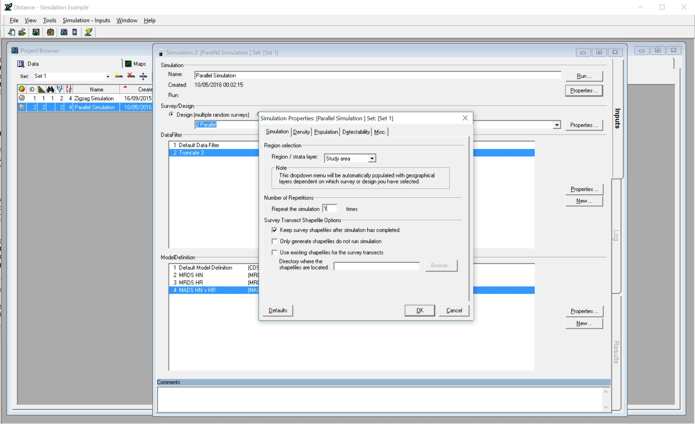
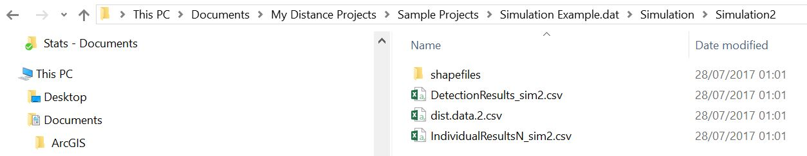

---
output:
  html_document: default
  pdf_document: default
---

```{r setup, include=FALSE}
knitr::opts_chunk$set(echo = TRUE, eval=FALSE)
```

# Create and analyse a simulated dataset

The purpose of this session is to refresh our memories of analysing straightforward distance sampling data. We will simulate a simple line transect dataset using the Distance simulation engine, so we know the true population size and detection function, and then analyze the data to see how close we are to the truth.  The exercise can be completed using Distance for Windows or `R` (or both!).

Note that there will be a full session on the simulation capabilities of Distance later in the workshop, so we won't try to tell you all about them here.  Instead, we'll give you the bare minimum of instructions you need to simulate a dataset, so you can focus on analyzing it.

## Exercise using Distance for Windows

This section is for you if you want to use Distance for Windows.  If you prefer to use `R` directly, skip to [Exercise using R].  

We'll assume you are familiar with analysis of line transect data using Distance for Windows, but that you have not yet used the simulation engine.  Hence the simulation instructions are quite detailed.

### Simulate a dataset

- In Distance for Windows, open the `Simulation example` sample project (Choose `File | Open Project...` and browse to the `Sample Projects` folder within `My Distance Projects`; click on the `Simulation example` project file and click on `Open`.)  

- Once the project is open, click on the `Simulations` tab of the `Project Browser`, and click on the 2nd simulation, called `Parallel Simulation` and open the `Simulation Details` window for this simulation (one way to do this is to choose the menu items `Simulation | Simulation Details`).

- Click the `Properties` button that is just below the `Run` button - this opens the `Simulation Properties` window.

- In the `Simulation` tab, under `Number of repetitions`, change the number 10 to 1, so it says `Repeat the simulation` 1 `times`.



- In the `Misc.` tab, tick the option `Save example dataset to file`

- Don't look in any of the other tabs for now -- they contain information about the true population size and detection function, and it'll be more fun if you don't know what these are until after you've analyzed the data!

- Click `OK` to close the `Simulation Properties` window.  Click `Run` to run the simulation.  After a pause while the simulation is running, the `Results` tab should go green.

You have now generated a simulated dataset, as a comma-separated text file (a ".csv" file).  Have a look for it using the Windows `File Explorer`.  The file will be located in the `Simulation example.dat` project folder (which in turn will be under `My Distance Projects`.  In the project folder, look in the subfolder `Simulation` and within that in the subfolder `Simulation2`.  You should see the file `dist.data.2.csv`



- Copy this file into the `My Distance Projects` folder, and rename it `SimData.txt` or some such.  Whatever you call it, make sure there is only one dot "." in its name, otherwise Distance is not going to want to import it (see later in these instructions).

### Import the data into Distance

- Back in `Distance`, create a new `Distance project` in the `My Distance Projects` folder. (Choose `File | New Project...`.)  Give it whatever name you like (e.g., `Simulated dataset`).  In the `New Project Setup Wizard` follow all the default options, except on `Step 4: Measurement Units` you should specify that Distances are in Meters, Transect lengths are in Meters and Areas are in Square meters.  On the last step (`Step 6: Finished`), choose the option to `Proceed to Data Import Wizard`.  Click on `Finish`.

- In the `Data Import Wizard`, in `Step 2`, choose to import the file containing the simulated data (`SimData.txt` or whatever you called it).

- In `Step 4`, choose Delimiter `Comma` and tick the option to `Do not import first row`.

- In `Step 5`, tick the option `Columns are in the same order as they will appear in the data sheet` - this saves you having to tell `Distance` which column is which.  Click `Next` and then `Finish`.

- Check the data has imported correctly using the `Data` tab of the `Project Browser`.  You may need to fix one annoying *bug* in the simulation engine: if there are any transects that have no observations then they don't get exported to the .csv file.  So, check that you have around 20 transects, and that the labels go sequentially from 1 to 20.  If not, you'll have to manually add a transect (with line length 200).  If you don't know how to do this, ask one of the instructors.

### Analyze the data in Distance

Once you've checked the data imported correctly, you can analyze the data in the normal way in Distance.  (There should be no need to truncate the data, as it was truncated in the simulation at 3m.)

You might want to try a few detection functions and use AIC to select among them.  Check the goodness-of-fit of the final model you select.

Optional (if you know about the advanced variance options): once you've selected a detection function model, you might want to think about which of the encounter rate variance options best suits the simulated scenario, which was a set of systematic parallel transects.

After you've finished your analysis, note the abundance estimate and confidence interval, and then open up the simulation project again.  The true abundance is given in the `Simulation properties`,  `Population` tab, under `Popultion size`, `Fixed N`.  How close is your estimate to the true value?  Does the confidence interval contain the true value?

The true detection function is given under the `Detectability` tab.  Did you select the true function?  If not, why not, and does it matter?

## Exercise using R

This section performs the same simulation in `R`.  Of course the actual simulated sample size and distances won't be the same, as they are different each time the simulation is run, but the scenario is the same.

You'll need to have the `DSsim` and `Distance` libraries installed in the version of R you're using.  Ask an instructor if you don't know how to do this.

### Simulate a dataset

We're going to use the `DSsim` package to do the simulation.  Paste the code below into the RStudio console (or paste them into an `R` script window and then click `Run` to source them into the console).

```{r sim}
library(DSsim)
library(shapefiles)

#Create study region
region <- make.region(coords = list(list(data.frame(x=c(0,0,500,500),y=c(0,200,200,0)))))

#Create population description
dens <- make.density(region = region, x.space = 8, y.space = 8, constant = c(10))
dens <- add.hotspot(dens, centre = c(100,50), sigma = 100, amplitude = 5)
dens <- add.hotspot(dens, centre = c(250,200), sigma = 50, amplitude = -5)
dens <- add.hotspot(dens, centre = c(300,70), sigma = 150, amplitude = 3)
pop.description <- make.population.description(region.obj = region, density.obj = dens, 
                                               N = c(500), fixed.N = TRUE)

#Specify detectability
det <- make.detectability(key.function = 'hr', scale.param = c(1.8), shape.param = c(3), truncation = 3)

#Create design
design <- make.design(transect.type = 'line', design.details = c('Parallel', 'Systematic'), 
                      region.obj = region, spacing = 25)

analysis <- make.ddf.analysis.list(dsmodel = list(~cds(key = 'hn', formula = ~1), 
                                                  ~cds(key = 'hr', formula = ~1)), 
                                   method = 'ds', criteria = 'AIC', truncation = 3)

#Create simulation specification
sim <- make.simulation(reps = 1, single.transect.set = FALSE, region.obj = region, 
                       design.obj = design, population.description.obj = pop.description, 
                       detectability.obj = det, ddf.analyses.list = analysis)

#Run a single survey and plot it
survey.res <- create.survey.results(sim,dht.tables=TRUE)
plot(survey.res)

#Extract the data needed for distance sampling analysis
distance.data <- get.distance.data(survey.res)
region.table <- survey.res@region.table@region.table
sample.table <- survey.res@sample.table@sample.table
obs.table <- survey.res@obs.table@obs.table
```

You are now ready to analyze the data!

### Detection function modelling

You may not be familiar with the `Distance` package in `R`, so the following code walks you through a simple analyses of the data we just generated.  If you are familiar with the `Distance` package, feel free to ignore this and do your own analysis.

The following code illustrates detection function modelling - feel free to try your own detection functions.

```{r detfunc}
library(Distance)
hncos.simdata <- ds(distance.data,key="hn",adjustment="cos",truncation=3)
unifcos.simdata <- ds(distance.data,key="unif",adjustment="cos",truncation=3)
hrpoly.simdata <- ds(distance.data,key="hr",adjustment="poly",truncation=3)
```

Compare the models, for example using AIC.  One can also plot the fitted functions, and look at goodness of fit -- you should certainly do that for the detection function you select.  As an illustration, here's model checking code for the hazard rate function:

```{r detfunc.gof}
plot(hrpoly.simdata)
ds.gof(hrpoly.simdata)
```

### Abundance estimation

Having selected a function, we want to estimate abundance.  To do this, we need to pass in the other data tables.  Here's example code, again using the hazard rate detection function.

```{r abund}
abund<-ds(distance.data,key="hr",adjustment="poly",truncation=3,
          region.table=region.table,sample.table=sample.table,obs.table=obs.table)
summary(abund)
```

The simulation scenario specified 500 individuals.  How close is your estimate to the true value?  Does your confidence interval contain the true value?

The true detection function was a hazard rate with no adjustment terms.  Did you select the true function?  If not, why not, and does it matter?
