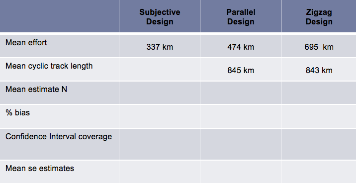
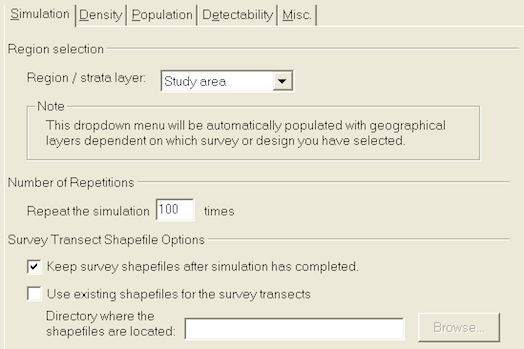
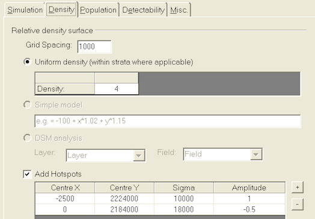

#  Creating distance sampling simulations using DSsim 

```{r pdfmakerdssim, echo=FALSE}
pdf <- FALSE
```

If you prefer to perform simulations using Distance 7.1, please skip ahead to the section [Running distance sampling simulations using Distance 7.1].

## Aim
The aim of this exercise is to run simulations which will allow you to compare three different survey designs for a specific population. You should judge these designs on their accuracy and precision.

You will also need the following R packages installed on your machine: `DSsim`, `shapefiles`, `splancs` and `mrds`. Now examine the other files and folders in the "DSsim Exercise" folder. There are three files starting with the name "Region" and ending with .dbf, .shp and .shx, these files make up the shapefile for the survey region. The "density.surface.robj" file is the density surface for the survey region. The "Survey Transects" folder contains a folder for each of the designs you are asked to look at, these contain the transect shapefiles. The "Results" folder contains the results from 999 replications as this can take a good few hours to run. To setup the workspace first load the packages `DSsim` and `shapefiles`, loading these two will automatically make `splancs` and `mrds` available.

```{r setupDSsim, message=FALSE, warning=FALSE}
library(DSsim)
library(shapefiles)
```

## Create a region object

Read the Region shapefile into R using the `read.shapefile()` function from the `shapefiles` package.

```{r regionobjDSsim}
region.shapefile <- read.shapefile("Region")
```

Next you are going to create the region object using this shapefile. As there are no strata you only need to provide a name for your survey region and the units which are in metres (m). The survey region is displayed in Figure \@ref(fig:finishreg).

```{r finishreg, fig.cap="Study region for simulation"}
region <- make.region(region.name = "Survey Region", units = "m", 
                      shapefile = region.shapefile)
plot(region, plot.units = "km")
```

## Create a density object
You are now going to create a density object within this region. For the purposes of this exercise a density surface has already been created and can be loaded as follows:

```{r densobjload}
load("density.surface.robj")
```

You will see that an object called `density.surface` has appeared in the workspace. This object is a list with one element (if the region had been divided up into strata then this list would contain an element for each strata). To have a look at what the density surface data look like type `head(density.surface[[1]])`. You can see that it is a data set of x and y locations and the densities at each point.

To create the density object you will need to provide the density surface, the region object for which it was created and the grid spacing that was used. I used a grid spacing of 1000m in both the x and y directions to create this density surface. The density surface describing animal distribution is shown in Figure 4.2.

```{r popden, fig.cap="Study region with animal density superimposed\nNote lower density near the trail system"}
pop.density <- make.density(region = region, density.surface = density.surface, 
                            x.space = 1000, y.space = 1000) 
plot(pop.density, plot.units = "km")
plot(region, add = TRUE)
```

Optionally, the following code can be used to define your own density surface. Firstly the density object is created with a constant value, then high and low spots can be added with varying radii of influence. The sigma parameter is used to calculate a Gaussian decay around the central point.

```{r altdensity, eval=FALSE}
alternative.density <- make.density(region = region, x.space = 1000, 
                                    y.space = 1000, constant = 0.4e-7)

alternative.density <- add.hotspot(alternative.density, centre = c(-2500, 2224000), 
                                   sigma = 10000, amplitude = 0.1e-7)
alternative.density <- add.hotspot(alternative.density, centre = c(0, 2184000), 
                                   sigma = 18000, amplitude = -0.5e-8)
```


## Creating population description and detectability objects
For this exercise we will fix the population size at 1500 individuals. To do this set N = 1500 and tell it to generate exactly this number of individuals (fixed.N = TRUE).

```{r popdescr}
pop.description <- make.population.description(region.obj = region, 
                                               density.obj = pop.density, 
                                               N = 1500, fixed.N = TRUE)
```

We will now describe the detectability of the population using a half-normal function with a sigma (scale.param) of 500m and a truncation distance of 1000m. This means that around 2/3 of the detections will be made within 500m of the transect and we will exclude anything sighted further than 1000m perpendicular distance from the transect.
```{r detect}
detect <- make.detectability(key.function = "hn", scale.param = 500, truncation = 1000)
```
## Creating the survey design object

We will now create a design object. For now concentrate on the subjective design, we will come back to the parallel and zigzag designs later. The subjective design was based on using some **existing paths** to make the survey easier to carry out. Additional transects were then added to achieve a more even coverage of the survey region.

NOTE: The path argument to describe where the files are located must match your previous settings add "/Survey Transects/Subjective Design".
```{r subjdes}
subjective.design <- make.design(transect.type = "Line", 
                                 design.details = c("user specified"), 
                                 region = region, 
                                 plus.sampling = FALSE, 
                                 path = "Survey Transects/Subjective Design")
```

## Creating the analyses object

The final thing we need to do before creating the simulation object is describe the analyses we wish to carry out on the simulated data. Let's try letting it choose between a half-normal and a hazard rate model based on the AIC values.
```{r detmodchoices}
ddf.analyses <- make.ddf.analysis.list(
                dsmodel = list(~cds(key = "hn", formula = ~1), #half-normal model
                               ~cds(key = "hr", formula = ~1)),  #hazard rate model
                method = "ds", criteria = "AIC", truncation = 1000)
```

## Creating the simulation object

We can finally put it all together and have a look at some example populations, transects and survey data. I suggest you set the number of repetitions (reps) to be fairly low or else it will take a long time to run. For the subjective design you need to specify that it will be using the same set of transects each time, single.transect.set = TRUE.
```{r simulation-characters}
my.simulation.subjective <- make.simulation(reps = 10, 
                                            single.transect.set = TRUE, 
                                            region.obj = region, 
                                            design.obj = subjective.design, 
                                            population.description.obj = pop.description,
                                            detectability.obj = detect, 
                                            ddf.analyses.list = ddf.analyses)
```

Before running the simulation it is a good idea to have a check to see that it is doing what you want. The function `check.sim.setup()` will allow you to investigate the simulation properties. Having created a population, transects, survey and detections, the function plots them to assure you are happy with the simulation structure.

Let's check our subjective design simulation, see Figure \@ref(fig:plotsimul).

```{r plotsimul, cache=TRUE, fig.cap="Region, population, transects, detections"}
check.sim.setup(my.simulation.subjective)
```

Once you are happy it is time to run the simulation. Please be patient as it will take a few minutes to complete.

```{r conductsim, comment=NA, cache = TRUE, results='hide'}
my.simulation.subjective  <- run(my.simulation.subjective)
summary(my.simulation.subjective, description.summary = FALSE)
```

## Now for the automated designs: Parallel lines

You will need to create a new simulation each with a new design object for the parallel design. The other objects (region, density, population description etc.) should be left the same. 

NOTE: We now wish different transects to be used on each repetition (`single.transect.set = FALSE`). 
```{r design-parallel}
parallel.design <- make.design(transect.type = "Line",
                               design.details = c("Parallel","Systematic"),
                               region.obj = region, design.axis = 45,
                               spacing = 12000, plus.sampling = FALSE,
                               path = "Survey Transects/Parallel Design")

my.simulation.parallel <- make.simulation(reps = 10, 
                                          single.transect.set = FALSE, 
                                          region.obj = region, 
                                          design.obj = parallel.design, 
                                          population.description.obj = pop.description,
                                          detectability.obj = detect,
                                          ddf.analyses.list = ddf.analyses)
```
Having created the features of the simulation, we want to check features of the simulation have been correctly specified, see Figure \@ref(fig:parallelcheck).

```{r parallelcheck, cache = TRUE, fig.cap="Check setup of parallel transect design simulation"}
check.sim.setup(my.simulation.parallel)
```

When satisfied with this simulation setup, you would proceed to run your parallel design simulation. 
```{r parallel-run, cache = TRUE, comment=NA, results='hide'}
my.simulation.parallel  <- run(my.simulation.parallel)
summary(my.simulation.parallel, description.summary = FALSE)
```


### ZigZag survey design
Now have a go at creating and running a simulation using the equal spaced zigzag design transects in the "Zigzag Design" folder. The spacing used to generate these was 8250m on a design axis of 135 degrees. Use `?make.design` for help.

```{r design-zigzag, echo=FALSE, eval=TRUE}
zigzag.design <- make.design(transect.type = "Line",
                               design.details = c("Zigzag","Equal Spaced"),
                               region.obj = region, design.axis = 135,
                               spacing = 8250, plus.sampling = FALSE,
                               path = "Survey Transects/Zigzag Design")

my.simulation.zigzag <- make.simulation(reps = 10, 
                                          single.transect.set = FALSE, 
                                          region.obj = region, 
                                          design.obj = zigzag.design, 
                                          population.description.obj = pop.description,
                                          detectability.obj = detect,
                                          ddf.analyses.list = ddf.analyses)
```
Having created the features of the simulation, check the features of the simulation have been correctly specified (Fig. \@ref(fig:zigzagcheck)).

```{r zigzagcheck, fig.cap="Check setup of zigzag transect design simulation", eval=TRUE, echo=FALSE}
check.sim.setup(my.simulation.zigzag)
```

When satisfied with this simulation setup, you would proceed to run your zigzag design simulation. 
```{r zigzag-run, comment=NA, eval=FALSE}
my.simulation.zigzag  <- run(my.simulation.zigzag)
summary(my.simulation.zigzag)
```


## Results from 999 repetitions

I ran each of these simulations 999 times and stored the simulations as R objects. Load these into the R workspace using the following code:

```{r bluepeter, eval=FALSE}
load("Results/simulation.subjective.robj")
load("Results/simulation.parallel.robj")
load("Results/simulation.zigzag.robj")
```

The objects `simulation.subjective`, `simulation.parallel` and `simulation.zigzag` will now be in your workspace. Have a look at the results using the `summary()` function and use them to fill in the table below, Figure 4.5.

```{r bluepeter-summaries, eval=FALSE}
summary(simulation.subjective)
summary(simulation.parallel)
summary(simulation.zigzag)
```

Which survey design would you recommend? Why?     
What would happen if our assumptions about animal distribution were incorrect?




## Running distance sampling simulations using Distance 7.1

If you would like to investigate different designs then these can be created and used in simulations in Distance 7.1. Note that currently the simulation options in Distance 7.1 are somewhat more restricted than in DSsim. 

We have created a Distance project based on the scenario just described and setup the systematic parallel and equal spaced zigzag designs as specified above. This project is named `DSsimExercise`. This exercise will lead you through replicating the previous simulations in Distance, but you could choose to investigate different designs or even try out some simulations on your own study area if you prefer. 

If you wish to try out simulations on your own study area help on importing geographic data, creating designs and analyses can be found in the Distance manual. 

## Creating simulations in Distance

### Simulation Details

Open the `DSsimExercise.dst` project and navigate to the Simulation Browser tab (on the far right, with the rabbit coming out of the hat). Now create a new simulation and give it a meaningful name. Open the details for this simulation, Figure 4.6.

* Select the **design** option for these simulations as we want to use a different survey (set of transects) in each iteration and then select which design to use from the dropdown menu. 
    + Distance will generate the required number of surveys for the simulation. (Selecting the **survey** option will instruct Distance to use only a single set of transects for the whole simulation.)     
* Select a data filter with an absolute right truncation distance. 
    + The truncation distance specified in the data filter will give the greatest perpendicular distance at which an observation can be made and the distance to which the detection function model(s) will be fitted.     
* Select one or more (mrds) models to fit to the simulated data. Here we can use the MADS HN v HR model definition (ID 3) to point to both the half-normal and hazard rate model definitions. 
    + Use the Properties button to have a look at the MADS model definition properties, particularly the detection function tab. 
    + The model with the minimum AIC will be selected in each simulation iteration. 


### Simulation Properties

Now click on the Simulation 'Properties' button to set the other simulation properties. The Simulation tab (Figure 4.7) allows us to specify the geographic layer to use, in this example as we do not have strata we must select the global study region layer. Here we can also tell Distance how many times to repeat the simulation and set shapefile options. It is sensible to run the simulation only once in the first instance to check the setup is correct. The shapefile options allow us to tell Distance to save the shapefiles for use in subsequent simulations using the same design. This can save some processing time. If requested the shapefiles are stored in the project .dat folder under 'Simulation/Simulation[ID]/shapefiles'.    



Next we can define our density surface which describes animal distribution (Figure 4.8). As in exercise 1A we can select a grid spacing of 1000. Distance has more restricted options than DSsim. Currently we are only able to specify a constant density surface with hot/low spots. Note that this density surface is just giving Distance the relative (rather than absolute) densities.    



\newpage

The Population tab (Figure 4.9) currently only requires that we provide a population size, in this case 1500.       


Next we describe the detectability of the animals. We will assume a half-normal detection function with sigma = 500m (Figure 4.10). The units of the detection function parameters must be the same as those of the study region and a reminder is provided below the table.            


Finally we can select some miscellaneous options. These do not affect the output seen within distance. The option to run the simulation in parallel can speed things up if running more than a few iterations. Saving the results from each iteration to file will create csv files with the individual estimates from each repetition. Saving an example dataset will create a csv file that is ready to be read into a distance project for analysis. These files are stored in the project .dat folder under 'Simulation/Simulation[ID]'.      

Further instructions on setting up different simulations options can be found in the Distance manual.

### Results

Solutions to this practical can be found in the DSsimExerciseSolutions.dst project. In this project both the parallel and zigzag design simulations have been run 100 times.       

Note that even though the designs were never initially run to estimate coverage, when a simulation is run this triggers the design to be run. Therefore, the design results give the coverage for the actual sets of transects used in the simulation.

