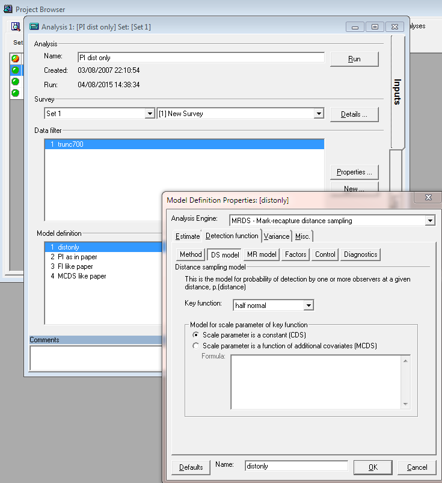

# Mark-recapture distance sampling of golftees

This document is designed to give you some pointers so that you can perform the Mark-Recapture Distance Sampling practical directly using the `mrds` package in R, rather than via the Distance graphical interface.  I assume you have some knowledge of R, the `mrds` package, and Distance.

```{r pdfmakermrds, echo=FALSE}
pdf <- FALSE
```


## Golf tee survey

The golf tee dataset is provided as part of the `mrds` package, as well as in the Distance `GolfteesExercise` project.


```{asis, d7mrdsgolfdata, echo=!pdf}
***
<details>
<summary>Distance 7 instructions</summary>
Data layers associated with the golftees dataset
<ul> 
<li> Note particularly the fields in the Observation layer: object, observer, detected.<br>

</ul> 
</details>

***
```
Open R and load the `mrds` package and golf tee dataset.
```{r preliminaries, message=FALSE, comment=NA}
library(knitr)
library(mrds)
data(book.tee.data)
#investigate the structure of the dataset
str(book.tee.data)
#extract the list elements from the dataset into easy-to-use objects
detections <- book.tee.data$book.tee.dataframe
#make sure sex and exposure are factor variables
detections$sex <- as.factor(detections$sex)
detections$exposure <- as.factor(detections$exposure)
region <- book.tee.data$book.tee.region
samples <- book.tee.data$book.tee.samples
obs <- book.tee.data$book.tee.obs
```
We'll start by fitting the initial full independence model, with only distance as a covariate - just as was done in the "FI - MR dist" model in Distance.  Indeed, if you did fit that model in Distance, you can look in the Log tab at the R code Distance generated, and compare it with the code we use here.

Feel free to use `?` to find out more about any of the functions used -- e.g., `?ddf` will tell you more about the ddf function.

```{r, fit-nocovar, message=FALSE, comment=NA, fig.height=4, fig.cap="Goodness of fit (FI-trial) to golftee data."}
#Fit the model
fi.mr.dist <- ddf(method='trial.fi',mrmodel=~glm(link='logit',formula=~distance),
                data=detections,meta.data=list(width=4))
#Create a set of tables summarizing the double observer data (this is what Distance does)
detection.tables <- det.tables(fi.mr.dist)
#Print these detection tables
detection.tables
# They could also be plotted, but I've not done so in the interest of space
# plot(detection.tables)

#Produce a summary of the fitted detection function object
summary(fi.mr.dist)

#Produce goodness of fit statistics and a qq plot
gof.result <- ddf.gof(fi.mr.dist, 
                      main="Full independence, trial mode goodness of fit\nGolftee data")
chi.distance <- gof.result$chisquare$chi1$chisq
chi.markrecap <- gof.result$chisquare$chi2$chisq
chi.total <- gof.result$chisquare$pooled.chi
```

```{asis, d7mrdsgolffit, echo=!pdf}
***
<details>
<summary>Distance 7 instructions</summary>
Specification of the full independence model with distance as the only covariate in the mark-recapture model, fitted with a logit transform


Having run this model in Distance 7, convince yourself the parameter estimates for sigma and the distance covariate are the same when using the Distance 7 interface as when using <i>mrds()</i> directly.
</details>

***
```

Abbreviated $\chi^2$ goodness of fit assessment shows the $\chi^2$ contribution from the distance sampling model to be `r round(chi.distance,1)` and the $\chi^2$ contribution from the mark-recapture model to be `r round(chi.markrecap,1)`.  The combination of these elements produces a total $\chi^2$ of `r round(chi.total$chisq,1)` with `r chi.total$df` degrees of freedom, resulting in a P-value of `r round(chi.total$p,3)`

```{r, abund-from-dist}
#Calculate density estimates using the dht function
tee.abund <- dht(fi.mr.dist,region,samples,obs)
kable(tee.abund$individuals$summary, digits=2, 
      caption="Survey summary statistics for golftees")
kable(tee.abund$individuals$N, digits=2, 
      caption="Abundance estimates for golftee population with two strata")
```

Now, see if you can work out how to change the call to ddf to fit the other models mentioned in the exercise, and then write code to enable you to compare the models and select among them.

## Crabeater seal survey

This analysis is described in @Borchers_2005 Biometrics paper of aerial survey data looking for seals in the Antarctic pack ice.  There were four observers in the plane, two on each side (front and back).  

The data from the survey has been saved in a `.csv` file. This file is read into R using `read.table()`.   Note that these tables are only needed when estimating abundance by scaling up from the covered region to the study area.

```{r, crabdet, comment=NA}
library(Distance)
crabseal <- read.csv("crabbieMRDS.csv")
#  Half normal detection function, 700m truncation distance, 
#      logit function for mark-recapture component
crab.ddf.io <- ddf(method="io", dsmodel=~cds(key="hn"),
                 mrmodel=~glm(link="logit", formula=~distance),
                 data=crabseal, meta.data=list(width=700))
summary(crab.ddf.io)
```

```{asis, d7mrdscrabfit, echo=!pdf}
***
<details>
<summary>Distance 7 instructions</summary>
Specification of the point independence model with distance as the only covariate in the mark-recapture model.  However under point independence, not only is the a mark-recapture model but also a distance sampling model (shown here)


Having run this model in Distance 7, convince yourself the parameter estimates for sigma and the distance covariate are the same when using the Distance 7 interface as when using <i>mrds()</i> directly.
</details>

***
```


Goodness of fit could be examined in the same manner as the golf tees by the use of `ddf.gof(crab.ddf.io)` but I have not shown this step.

Following model criticism and selection, estimation of abundance ensues.  The estimates of abundance for the study area are arbitrary because inference of the study was restricted to the covered region.  Hence the estimates of abundance here are artificial. For illustration, the `checkdata()` function produces the region, sample, and observation tables. From these tables Horvitz-Thompson like estimators can be applied to produce estimates of $\hat{N}$.  The use of `convert.units` adjusts the units of perpendicular distance measurement (m) to units of transect effort (km).  Be sure to perform the conversion correctly or your abundance estimates will be off by orders of magnitude.

```{r, crabsummary}
tables <- Distance:::checkdata(crabseal[crabseal$observer==1,])
crab.ddf.io.abund <- dht(region=tables$region.table, 
                         sample=tables$sample.table, obs=tables$obs.table,
                         model=crab.ddf.io, se=TRUE, options=list(convert.units=0.001))
kable(crab.ddf.io.abund$individuals$summary, digits=3,
      caption="Summary information from crabeater seal aerial survey.")
```

```{r, crabestimates}
kable(crab.ddf.io.abund$individual$N, digits=3,
      caption="Crabeater seal abundance estimates for study area of arbitrary size.")
```

```{asis, d7mrdscrabestimates, echo=!pdf}
***
<details>
<summary>Distance 7 instructions</summary>
Specification of the point independence model with distance as the only covariate in the mark-recapture model.  However under point independence, not only is the a mark-recapture model but also a distance sampling model (shown here).


The abundance estimates are not an exact match between the Distance 7 analysis and the mrds() analysis because of slight differences in the datasets.  However, there is general agreement that the seal population size in this arbitrary study area is approximately 400,000 with a CV of ~10%.
</details>

***
```
